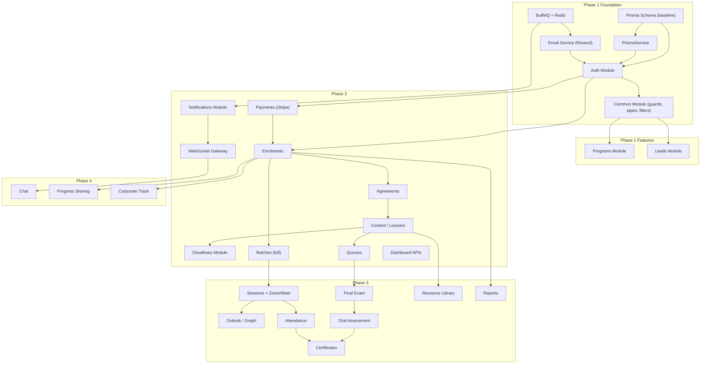

# WhatBoutMe LMS — Architecture Baseline v3

> **Purpose:** Final architecture validation before Phase 1 implementation
> **Date:** October 2, 2026
> **Authors:** Foxwel.AI Backend Team
> **Classification:** Architecture Decision Record — DO NOT IMPLEMENT until signed off

---

## A. Executive Summary

This document validates every backend architectural decision for the WhatBoutMe LMS against the client PDF ("WhatBoutMe LMS: Development Plan", Sep 28, 2026) and the existing repository. It replaces Architecture Baseline v2.

**Key changes from v2:**

| Area | v2 Decision | v3 Decision | Reason |
|------|------------|-------------|--------|
| Video streaming | Mux | **Cloudinary** | Project decision; Cloudinary supports authenticated delivery, signed URLs, domain restriction, and dynamic watermark overlays |
| Development database | Docker PostgreSQL or AWS RDS | **Neon Free Plan PostgreSQL** | Zero-cost development matching production PostgreSQL engine |
| Production database | AWS RDS (decided) | **PostgreSQL provider TBD** (AWS RDS planned) | PDF says Neon; production provider is a deployment-phase decision |
| Object storage | S3 vs R2 (unresolved) | **Evaluated below** | Requires resolution aligned with Cloudinary choice |
| Named permissions | Unresolved | **Config-driven with DB migration path** | PDF: "adjustable without code changes" |

**Scope:** Backend only. Frontend is developed separately by another team. We define API contracts.

---

## B. Source-of-Truth Hierarchy

| Priority | Source | Use |
|:--------:|--------|-----|
| **1** | Client PDF ("WhatBoutMe LMS: Development Plan", Sep 28, 2026) | Business requirements, feature scope, user roles, integration list |
| **2** | This document (Architecture Baseline v3) | Technology decisions, architecture patterns, constraints |
| **3** | Existing repository code | Evidence of what exists, what is reusable, what is broken |
| **4** | Previous architecture documents (ARCHITECTURE.md, PRD.md, etc.) | Reference only; may contain decisions that contradict PDF or best practice |

> [!IMPORTANT]
> The existing repository implementation is NOT authoritative. It contains prototype code, incorrect business logic (e.g., auto-enrolment bypassing payment), and outdated technology choices (Mux). Every decision is validated from first principles.

---

## C. Decision Matrix

### C.1 Core Stack

| # | Decision | Status | PDF Evidence | Reasoning |
|---|----------|:------:|-------------|-----------|
| C1 | **NestJS** for backend API | ✅ DECIDED | "NestJS for the back end API" (Tech Stack §) | PDF explicit. Current repo uses NestJS 12. Modular architecture matches PDF module list. |
| C2 | **PostgreSQL** as database engine | ✅ DECIDED | "Neon (serverless PostgreSQL) as the database" (Tech Stack §) | Neon is PostgreSQL. Application code targets standard PostgreSQL via Prisma. |
| C3 | **Neon Free Plan** for development database | ✅ DECIDED | PDF names Neon explicitly | Zero-cost dev environment. Same PostgreSQL engine. Neon branching available for dev/staging. |
| C4 | **PostgreSQL production provider** (AWS RDS planned) | 🟡 CONDITIONAL | PDF says Neon; ARCHITECTURE.md says AWS RDS | Production provider is a deployment-phase decision. Application code is provider-neutral via Prisma. AWS RDS is the planned option but not committed until deployment phase. **Requires:** production infrastructure planning. |
| C5 | **Prisma ORM** | ✅ DECIDED | Not in PDF; already in repo | Type-safe queries, migration management, schema-as-code. Industry standard for NestJS + PostgreSQL. Provider-neutral. |
| C6 | **Turborepo** monorepo | ✅ DECIDED | PDF implies monorepo: "One Next.js app... NestJS... modules" | Already initialized. Supports shared packages between frontend and backend. |
| C7 | **Next.js** frontend boundary | ✅ DECIDED | "Next.js for the front end" (Tech Stack §) | Frontend team's responsibility. Backend defines REST API contracts. We do not implement frontend. |
| C8 | **Separate job worker** process | ✅ DECIDED | "A separate job worker handles scheduled and slow work: reminders, calendar sync, pulling meeting attendance, sending emails, generating certificates" (Tech Stack §) | PDF explicit. Worker runs BullMQ consumers. Deployed as separate process from API. |

### C.2 Authentication & Authorization

| # | Decision | Status | PDF Evidence | Reasoning |
|---|----------|:------:|-------------|-----------|
| C9 | **Custom NestJS + Passport + JWT** | ✅ DECIDED | PDF does not name any managed auth provider. "NestJS... checks the user's role first" | No requirement for Clerk, Auth0, or Cognito. Custom auth gives full control over session limits, 2FA, OTP, and unusual-login logging. Current repo has working JWT foundation. |
| C10 | **JWT access tokens (15m) + refresh tokens (7d)** | ✅ DECIDED | Implicit in "role checks on the server for every request" | Short-lived access tokens for stateless API auth. Refresh tokens for session continuity. Current repo implements this pattern. |
| C11 | **Refresh token rotation with hash storage** | ✅ DECIDED | Not in PDF; security best practice | Current repo stores bcrypt hash of refresh token in `UserSession`. Rotation on each refresh prevents replay. |
| C12 | **Email/password login** | ✅ DECIDED | "Sign up with email and password or a one-time email code" (§2) | Primary login method. Currently implemented. |
| C13 | **One-time email OTP login** | ✅ DECIDED | "Sign up with email and password or a one-time email code" (§2) | PDF explicit alternative login. **NOT implemented.** Requires email service + OTP model. |
| C14 | **Email verification** | ✅ DECIDED | "Sign-up, email verification, password reset" (Notifications table) | PDF lists it as an immediate notification trigger. **NOT implemented.** Currently signup creates an unverified active user. |
| C15 | **Password reset** | ✅ DECIDED | "password reset" (Notifications table) | PDF explicit. **NOT implemented.** |
| C16 | **Country + timezone capture at signup** | ✅ DECIDED | "Capture country and time zone at sign-up" (§2) | PDF explicit. User model currently **lacks** `country` and `timezone` fields. |
| C17 | **Admin 2FA (TOTP or email)** | ✅ DECIDED | "Admin login uses two-step verification (email or authenticator code)" (Roles §) | PDF explicit. **NOT implemented.** Needs TOTP library (e.g., `otpauth`) or email-based 2FA. |
| C18 | **Device/session limit: 2 for learners** | ✅ DECIDED | "Limit active sessions per learner (for example two devices). Logging in on a third device signs out the oldest." (Content Protection §) | PDF says "two devices". Current code sets `maxSessions = 1` for USER. **Must fix to 2.** |
| C19 | **Unusual-login logging** | ✅ DECIDED | "Log unusual activity, such as many logins from different countries, for admin review" (Content Protection §) | PDF explicit. **NOT implemented.** Needs IP capture + country detection + admin review UI. |
| C20 | **Revoked-session validation** | ✅ DECIDED | Implied by session limits | Current JWT strategy checks `UserSession` existence but **does not check `revokedAt`**. Must verify revocation status on every authenticated request. |
| C21 | **Named permissions** | ✅ DECIDED | "Permissions are stored as named actions (for example 'approve certificate', 'edit content') grouped into roles, so a role can be adjusted later without code changes." (Roles §) | PDF explicit. **NOT implemented.** Current repo uses simple enum-based `RolesGuard`. See §D.3 for implementation approach. |
| C22 | **Manager batch scoping** | ✅ DECIDED | "Managers only see data for batches they are assigned to" (Roles §) | PDF explicit. Current `sessions.service.ts` has a partial check (`managerId !== user.sub`). Needs a systematic `BatchAccessGuard`. |
| C23 | **No social login** | ✅ DECIDED | PDF does NOT mention LinkedIn, Google, Facebook, or any social OAuth login | Do not implement. |
| C24 | **OAuth 2.0 for external integrations only** | ✅ DECIDED | Zoom S2S OAuth, MS Graph OAuth, Google Calendar OAuth are integration-level, not user-login | OAuth/OIDC is NOT an alternative to the application's JWT authentication. It is used solely for third-party API access (Zoom, Outlook, Google Meet). |
| C25 | **No separate admin-login endpoint** | 🔍 PENDING VALIDATION | PDF: "One login per person, with what they see decided by their role" (Guiding Principles) | Current repo has separate `/auth/admin-login`. PDF says "one login per person." Consider merging into a single login endpoint that checks 2FA for admin/super-admin roles. The frontend can route based on role after login. |

### C.3 Database

| # | Decision | Status | PDF Evidence | Reasoning |
|---|----------|:------:|-------------|-----------|
| C26 | **Single Prisma schema** in `apps/api/prisma/` | ✅ DECIDED | — | Single source of truth. The `packages/database/` duplicate schema must be ignored/removed. |
| C27 | **Provider-neutral schema** | ✅ DECIDED | — | Schema must work identically on Neon PostgreSQL, Docker PostgreSQL, and AWS RDS PostgreSQL. No Neon-specific extensions. |
| C28 | **`directUrl` in datasource** | ❌ REJECTED | — | Current schema has `directUrl = env("DIRECT_URL")`. This is Neon-specific (for bypassing connection pooler during migrations). **Remove from schema.** Handle via environment-specific migration scripts if needed, not in the schema definition. If Prisma requires `directUrl` for Neon migrations, configure it via environment variable without hardcoding in the schema. |
| C29 | **UUID primary keys** | ✅ DECIDED | Not in PDF; security best practice | Prevents enumeration attacks. All models already use `@default(uuid())`. |
| C30 | **Soft delete on User** | ✅ DECIDED | "let a learner download or delete their data on request" (Non-Functional §) | `deletedAt` field. UAE PDPL compliance. Preserves financial aggregate data. |
| C31 | **Remove `Order` model** | ✅ DECIDED | PDF describes payment via Stripe Checkout → Payment → Enrolment. No "Order" concept. | `Order`, `OrderStatus`, `OrderProvider` are prototype artifacts. `Payment` model handles Stripe integration. |
| C32 | **Remove `packages/database/`** | ✅ DECIDED | — | Stale duplicate with only a basic User model. Causes confusion about canonical schema location. |
| C33 | **Migration strategy** | ✅ DECIDED | — | `prisma migrate dev` for development on Neon. `prisma migrate deploy` for production. One migration history. Dev A owns migration execution (see §W). |

### C.4 Email

| # | Decision | Status | PDF Evidence | Reasoning |
|---|----------|:------:|-------------|-----------|
| C34 | **Resend for transactional email** | 🟡 CONDITIONAL | "Email delivery service... Use a proper sending domain on whatboutme.com with SPF and DKIM set up" (Integrations §) | Best DX for NestJS. Excellent deliverability. **Conditional on:** Resend account creation + DNS access for SPF/DKIM on `whatboutme.com`. |
| C35 | **React Email for templates** | ✅ DECIDED | — | Type-safe JSX templates. Composable components. Better DX than Handlebars for a TypeScript team. |
| C36 | **Editable templates in admin** | ✅ DECIDED | "All emails use editable templates in admin (subject, body, on or off)" (Notifications §) | PDF explicit. Needs `NotificationTemplate` model. Admin can edit subject/body and toggle templates on/off. |
| C37 | **Email delivery logging** | ✅ DECIDED | "Keep a log of every email sent and its delivery status" (Notifications §) | PDF explicit. Via Resend webhooks → `NotificationDelivery` model. |
| C38 | **`whatboutme.com` sending domain** | 🟡 CONDITIONAL | "proper sending domain on whatboutme.com with SPF and DKIM" (Integrations §) | **Requires:** DNS access (client input C2). SPF + DKIM + DMARC records. |

### C.5 Background Jobs

| # | Decision | Status | PDF Evidence | Reasoning |
|---|----------|:------:|-------------|-----------|
| C39 | **BullMQ + Redis** for job queues | ✅ DECIDED | "A separate job worker handles scheduled and slow work" (Tech Stack §) | Industry standard for NestJS. Supports delayed, repeatable, and prioritized jobs. |
| C40 | **Redis for sessions + queues + caching** | ✅ DECIDED | Implied by session management + job worker requirements | Current repo uses Upstash Redis (REST-based) for throttling only. BullMQ requires a standard Redis connection (not REST). **Local dev:** Docker Redis or a hosted Redis instance. **Production:** AWS ElastiCache or equivalent. |
| C41 | **Worker as separate process** | ✅ DECIDED | PDF explicit | Separate `worker.ts` entry point consuming BullMQ queues. Deployed alongside API but as a distinct process. |

### C.6 Video & Media

| # | Decision | Status | PDF Evidence | Reasoning |
|---|----------|:------:|-------------|-----------|
| C42 | **Cloudinary for video streaming** | ✅ DECIDED | "Videos go to a secure streaming service, not plain file storage" (Data & Storage §). Project decision replaces Mux. | Cloudinary supports: authenticated delivery type, signed URLs with expiry, strict transformations, allowed referral domains (domain restriction), dynamic text/image overlay watermarks. |
| C43 | **Mux module removal** | ✅ DECIDED | — | Current `modules/mux/` and `@mux/mux-node` dependency are obsolete. Replace with Cloudinary module. |
| C44 | **Cloudinary authenticated upload** | ✅ DECIDED | "Stream through the video service with short-lived signed links" (Content Protection §) | Upload videos with `type: 'authenticated'`. Requires signed URL for all access. |
| C45 | **Cloudinary signed delivery URLs** | ✅ DECIDED | "short-lived signed links, never a direct file URL" (Content Protection §) | Backend generates signed URL with `expires_at` (e.g., 2 hours). Frontend uses URL for playback. |
| C46 | **Cloudinary domain restriction** | ✅ DECIDED | "Restrict playback to whatboutme.com so embed links do not work elsewhere" (Content Protection §) | Configure "Allowed strict referral domains" in Cloudinary security settings. |
| C47 | **Cloudinary strict transformations** | ✅ DECIDED | Implied by content protection requirements | Prevents users from requesting video without watermark overlay by blocking unauthorized transformations. |
| C48 | **Moving watermark via Cloudinary overlay** | 🔍 PENDING VALIDATION | "Moving watermark over the video with the learner's name or email, so any leak can be traced" (Content Protection §) | Cloudinary supports dynamic text overlays on video. However, a truly "moving" watermark (changing position over time) may require: (a) Cloudinary's video overlay positioning capabilities, or (b) a client-side canvas overlay on the custom player. **Spike required** to determine if Cloudinary transformation can position text dynamically per frame, or whether a client-side overlay is the practical approach. |
| C49 | **Cloudinary for session recordings** | ✅ DECIDED | "After the class, admin uploads the recording or it is pulled from Zoom automatically. Recordings play in the view-only player for that batch." (§7) | Zoom recordings can be uploaded to Cloudinary after extraction. Served with same authenticated/signed URL pattern. |

### C.7 Object Storage

| # | Decision | Status | PDF Evidence | Reasoning |
|---|----------|:------:|-------------|-----------|
| C50 | **Private object storage for PDFs, audio, images, agreements, certificates** | ✅ DECIDED | "PDFs and audio go to private object storage and are served only through short-lived signed links" (Data & Storage §) | Separate from video streaming. These are non-streamable files requiring download-like access via signed URLs. |
| C51 | **AWS S3 for private object storage** | 🟡 CONDITIONAL | ARCHITECTURE.md specifies S3. PDF says "private object storage" generically. | S3 is the most mature option. Compatible with planned AWS production infrastructure. **Conditional on:** AWS account setup. Can use S3-compatible alternatives (R2, MinIO) in development. |
| C52 | **Cloudflare R2 as S3 alternative** | 🔍 PENDING VALIDATION | — | R2 is S3-compatible (same API). Zero egress fees. Lower cost at scale. However, adds cross-provider complexity if other infrastructure is on AWS. **Evaluate if cost savings justify operational overhead.** |
| C53 | **Cloudinary for images** (non-sensitive) | ✅ DECIDED | — | Program cover images, profile photos, and public assets can use Cloudinary's image transformations (resize, optimize, format). These do NOT require authenticated delivery. Sensitive images (agreement scans) go to private object storage. |

### C.8 Meeting Providers

| # | Decision | Status | PDF Evidence | Reasoning |
|---|----------|:------:|-------------|-----------|
| C54 | **`IMeetingProvider` abstraction** | ✅ DECIDED | "Build behind one 'meeting provider' layer so either can be switched on" (Integrations §) | PDF explicit. Interface with: `createMeeting()`, `getMeetingDetails()`, `getParticipantReport()`, `getRecordingUrl()`. |
| C55 | **Zoom as primary provider** | 🟡 CONDITIONAL | "Zoom or Google Meet" (Integrations §) | **Conditional on:** Zoom Pro license + Server-to-Server OAuth app registration (client input C8). Current repo has a basic `ZoomService` with S2S OAuth token acquisition and meeting creation. |
| C56 | **Google Meet as secondary provider** | 🟡 CONDITIONAL | "Zoom or Google Meet" (Integrations §) | **Conditional on:** Google Workspace account + Calendar API credentials. Implemented via Google Calendar API (meetings are calendar events with conferencing). |
| C57 | **Zoom Server-to-Server OAuth** | ✅ DECIDED | "Creating meeting links, recordings, participant reports for attendance" (Integrations §) | NOT user-facing OAuth. App-level credentials for API access. Current `zoom.service.ts` implements this correctly. |
| C58 | **Zoom webhook handler** | ✅ DECIDED | "Webhook endpoints for... Zoom or Google Meet" (Tech Stack §) | `POST /webhooks/zoom` for `recording.completed`, `meeting.ended`. Auto-fetch participant list for attendance. |
| C59 | **Provider-specific metadata storage** | ✅ DECIDED | Implicit | `Session` model needs: `meetingProvider` (enum: ZOOM, GOOGLE_MEET), `providerMeetingId`, `providerJoinUrl`, `providerRecordingUrl`. Current schema only has `zoomMeetingId`. |

### C.9 Microsoft Outlook / Graph

| # | Decision | Status | PDF Evidence | Reasoning |
|---|----------|:------:|-------------|-----------|
| C60 | **MS Graph API for Outlook calendar** | 🟡 CONDITIONAL | "Adding sessions to Roweena's calendar, reading her busy times for booking slots. Two-way: a clash in Outlook blocks that slot on the site." (Integrations §) | **Conditional on:** Azure AD app registration + Microsoft 365 license (client input C9). |
| C61 | **Application permissions (not delegated)** | 🔍 PENDING VALIDATION | "Adding sessions to Roweena's calendar" — implies server acts on behalf of a specific user | Application permissions allow the backend to read/write Roweena's calendar without her being logged in. Delegated permissions require an interactive OAuth consent flow. For a server-side worker that syncs calendar in the background, **application permissions** are more appropriate. However, application permissions require admin consent in Azure AD and access to a specific mailbox. **Spike:** confirm Azure AD app registration process and whether the client's Microsoft 365 plan supports application permissions for Calendar. |
| C62 | **Two-way calendar sync** | ✅ DECIDED | "Two-way: a clash in Outlook blocks that slot on the site" (Integrations §) | Create session → create Outlook event. Read Outlook busy times → block booking slots. This is NOT full bidirectional sync (changes in Outlook don't auto-update our DB). It's: read busy times + write events. |
| C63 | **Booking availability** | ✅ DECIDED | "Learners book slots from Roweena's available times, shown in their own time zone" (§7) | API reads Roweena's Outlook calendar via Graph → returns available slots in learner's timezone. |

### C.10 Realtime / Chat

| # | Decision | Status | PDF Evidence | Reasoning |
|---|----------|:------:|-------------|-----------|
| C64 | **Socket.IO for WebSocket** | ✅ DECIDED | "Real-time connection (websockets) for chat and live notifications" (Tech Stack §) | Standard NestJS WebSocket gateway via `@nestjs/websockets` + `@nestjs/platform-socket.io`. |
| C65 | **JWT handshake authentication** | ✅ DECIDED | Implied by "checks the user's role first" | WebSocket connection authenticated via JWT token in handshake. User joins room `user:{userId}`. |
| C66 | **Redis adapter for scaling** | 🟡 CONDITIONAL | — | Required if API runs on multiple instances (ECS Fargate tasks). `@socket.io/redis-adapter` ensures events broadcast across instances. **Conditional on:** multi-instance deployment. Single instance doesn't need it. |
| C67 | **1:1 chat (learner ↔ staff)** | ✅ DECIDED | "Private chat between a learner and the team (Roweena, admins, or the batch manager)" (§11) | Schema has `Conversation` + `Message`. |
| C68 | **Staff shared inbox** | ✅ DECIDED | "Staff see a shared inbox of all learner conversations, can assign a chat to a team member, and mark it resolved" (§11) | `Conversation` model needs: `assignedToId`, `resolvedAt`, `resolvedById` fields. **Missing from current schema.** |
| C69 | **Read receipts + typing indicators** | ✅ DECIDED | "Read receipts and typing status" (§11) | WebSocket events: `chat:typing`, `chat:read`. `Message.readAt` field needed. Current schema has `read: Boolean` — should be `readAt: DateTime?` for timestamp. |
| C70 | **File/image attachments** | ✅ DECIDED | "Text, emoji, file and image attachments" (§11) | Upload to object storage, return signed URL. Max file size configurable. |

### C.11 Notifications

| # | Decision | Status | PDF Evidence | Reasoning |
|---|----------|:------:|-------------|-----------|
| C71 | **19 notification types** | ✅ DECIDED | Notifications table in PDF lists 19 triggers | All must be implemented across the relevant sprints. |
| C72 | **Dual channel: email + in-app** | ✅ DECIDED | "Every message is also shown in the in-app notification bell" (Notifications §) | Each notification creates an in-app record AND optionally sends email (based on template + preferences). |
| C73 | **Editable templates in admin** | ✅ DECIDED | "All emails use editable templates in admin (subject, body, on or off)" (Notifications §) | `NotificationTemplate` model with: `type`, `subject`, `body`, `isActive`, `channel`. |
| C74 | **Timezone-aware sending** | ✅ DECIDED | "Send times respect the learner's time zone" (Notifications §) | BullMQ delayed jobs scheduled to fire at the correct local time. Requires User.timezone field. |
| C75 | **Learner preference toggle** | ✅ DECIDED | "Learners can turn off non-essential emails. Payment, agreement and session emails always send." (Notifications §) | `NotificationPreference` model. Mandatory categories (payment, agreement, session) cannot be disabled. |
| C76 | **Delivery status tracking** | ✅ DECIDED | "Keep a log of every email sent and its delivery status" (Notifications §) | `NotificationDelivery` model tracking QUEUED → SENT → DELIVERED → BOUNCED → FAILED. Updated via Resend webhooks. |

### C.12 Content Protection

| # | Decision | Status | PDF Evidence | Reasoning |
|---|----------|:------:|-------------|-----------|
| C77 | **Content protection = deterrence, not DRM** | ✅ DECIDED | "No web platform can fully stop a determined person from screen-recording, so the goal is to make downloading hard and sharing traceable. Set this expectation with the client." (Content Protection §) | PDF itself acknowledges limitations. All controls are deterrence-level. Do not overstate security guarantees. |
| C78 | **Video: authenticated + signed + domain-restricted + no-download player** | ✅ DECIDED | Content Protection § (Video) | See C44–C47. Cloudinary authenticated delivery + signed URLs + domain restriction + custom player without download controls. |
| C79 | **Video: moving watermark** | 🔍 PENDING VALIDATION | "Moving watermark over the video with the learner's name or email" (Content Protection §) | Cloudinary text overlay is static per transformation URL. A truly "moving" watermark likely requires a **client-side player overlay** (CSS/canvas layer that repositions text periodically). **Spike required.** See §U. |
| C80 | **PDF: in-app viewer, no download/print** | ✅ DECIDED | "Shown in an in-app viewer (PDF rendered page by page), no download or print button" (Content Protection §) | Frontend implements using `react-pdf` or similar. Backend serves signed URLs. No `Content-Disposition: attachment` header. |
| C81 | **PDF: learner-name watermark** | 🔍 PENDING VALIDATION | "Light watermark with the learner's name on PDF pages" (Content Protection §) | Options: (a) Runtime watermark via `pdf-lib` when generating signed URL (adds processing time), (b) Pre-generate watermarked copy per learner on first access and cache, (c) Client-side canvas overlay (less secure). **Spike required** on `pdf-lib` performance for on-the-fly watermarking. |
| C82 | **Session limit: 2 devices** | ✅ DECIDED | "two devices" (Content Protection §) | See C18. |

### C.13 Certificates

| # | Decision | Status | PDF Evidence | Reasoning |
|---|----------|:------:|-------------|-----------|
| C83 | **Eligibility engine** | ✅ DECIDED | "Issued only when all steps, quizzes, the final exam, oral assessment, required attendance and the closing call are complete" (§10) | Service method: `checkCertificateEligibility(enrolmentId)`. Returns boolean + list of unmet requirements. |
| C84 | **Admin approval workflow** | ✅ DECIDED | "Held in a pending list until admin approves" (§10) | State: ELIGIBLE → PENDING → APPROVED / REJECTED. Current repo has a basic version but skips eligibility check. |
| C85 | **PDF generation via worker** | ✅ DECIDED | "Generated as a PDF with learner name, program, date, CPD hours and certificate number" (§10) | BullMQ `certificate-gen` job. Use `@react-pdf/renderer` or Puppeteer to render template → PDF → upload to object storage. |
| C86 | **Certificate templates** | ✅ DECIDED | "Admin uploads and manages certificate templates" (§10) | `CertificateTemplate` model. Admin uploads template design. System renders with learner data. |
| C87 | **Unique certificate number** | ✅ DECIDED | "certificate number" (§10) | Current schema has `certificateNumber @unique`. Current code uses `CERT-{timestamp}-{random}`. Consider a more structured format (e.g., `WBM-2026-00001`). |
| C88 | **Public verification page** | ✅ DECIDED | "Certificates get a public verification page by certificate number" (§9) | `GET /api/certificates/verify/:certNumber` — public, no auth. Returns learner name, program, date, CPD hours. |
| C89 | **LinkedIn "Add to Profile" button** | ✅ DECIDED | "an 'Add to LinkedIn profile' button" (§9) | Frontend generates LinkedIn certification URL. Backend provides the data (program name, issuing org, date, cert URL). |
| C90 | **Corporate participation certificate** | ✅ DECIDED | "Corporate workshop track gets a separate certificate of participation with no exam or CPD hours" (§10) | Different template, different eligibility rules (attendance only, no exam/quiz requirements). |

### C.14 Deployment / Infrastructure

| # | Decision | Status | PDF Evidence | Reasoning |
|---|----------|:------:|-------------|-----------|
| C91 | **Development: Neon Free Plan PostgreSQL** | ✅ DECIDED | PDF names Neon. Project decision for zero-cost dev. | `DATABASE_URL` points to Neon. Same PostgreSQL engine and Prisma schema as production. |
| C92 | **Development: Docker Redis** | ✅ DECIDED | — | Local Redis for BullMQ, sessions, caching. Already in `docker-compose.yml`. |
| C93 | **Production: PostgreSQL provider TBD** | 🟡 CONDITIONAL | PDF says Neon. ARCHITECTURE.md says AWS RDS. | AWS RDS is the planned production option for reliability, private VPC networking, automated backups. Decision deferred to deployment phase. Application is provider-neutral. |
| C94 | **Production: AWS ElastiCache (Redis)** | 🟡 CONDITIONAL | — | Planned for production Redis. Deferred to deployment phase. |
| C95 | **Production: AWS ECS Fargate** | 🟡 CONDITIONAL | — | Container orchestration for API + Worker. Deferred to deployment phase. |
| C96 | **Production: AWS Amplify or CloudFront** | 🟡 CONDITIONAL | — | Frontend hosting. Frontend team's decision. |
| C97 | **Production: object storage (S3/R2)** | 🟡 CONDITIONAL | — | See C51/C52. Deferred to deployment phase. Dev can use Cloudinary for all media and defer object storage setup. |
| C98 | **Sentry for error tracking** | ✅ DECIDED | "error tracking on front end and API" (Non-Functional §) | Sentry is the industry standard. Free tier sufficient for initial development. |
| C99 | **Docker Compose for local services** | ✅ DECIDED | — | Already exists with PostgreSQL + Redis. PostgreSQL container is optional (can use Neon instead). Redis container is needed for BullMQ. |
| C100 | **Do NOT provision AWS resources now** | ✅ DECIDED | Project rule | All AWS provisioning is a deployment-phase activity. Development uses Neon + Docker Redis + Cloudinary. |

---

## D. Authentication & Authorization Architecture

### D.1 Token Architecture

```
┌─────────────┐     ┌──────────────────┐     ┌─────────────────────┐
│   Browser    │────▶│  NestJS API      │────▶│  PostgreSQL (Neon)   │
│              │     │                  │     │                     │
│ Bearer Token │     │ JWT Strategy     │     │ UserSession table    │
│ (access_token│     │  ↓ validate()    │     │  - token hash        │
│  in header)  │     │  1. Verify JWT   │     │  - revokedAt         │
│              │     │  2. Check session│     │  - ipAddress         │
│              │     │     revocation   │     │  - userAgent         │
│              │     │  3. Attach user  │     │  - lastActive        │
│              │     │     to request   │     │                     │
└─────────────┘     └──────────────────┘     └─────────────────────┘
```

**Critical fix needed:** Current `jwt.strategy.ts` (line 18-27) checks session existence but does NOT check `session.revokedAt`. A revoked session with an existing record will still pass validation.

### D.2 Auth Flows Required

| Flow | PDF Reference | Status |
|------|--------------|:------:|
| Email/password signup | §2 | ✅ Exists (needs fixes) |
| Email/password login | §2 | ✅ Exists |
| Email verification | Notifications table | ❌ Missing |
| One-time email OTP | §2 | ❌ Missing |
| Password reset | Notifications table | ❌ Missing |
| Admin 2FA (TOTP/email) | Roles § | ❌ Missing |
| Refresh token rotation | Best practice | ✅ Exists |
| Session revocation check | Content Protection § | 🐛 Buggy (doesn't check revokedAt) |
| Device limit enforcement | Content Protection § | 🐛 Wrong limit (1 vs 2) |
| Logout all sessions | Best practice | ✅ Exists |
| Unusual login detection | Content Protection § | ❌ Missing |

### D.3 Named Permissions Architecture

PDF: "Permissions are stored as named actions... grouped into roles, so a role can be adjusted later without code changes."

**Approach: Config-driven with future DB migration path**

```typescript
// permissions.config.ts — the single source of truth
export const ROLE_PERMISSIONS: Record<Role, string[]> = {
  SUPER_ADMIN: ['*'], // all permissions
  ADMIN: [
    'program.create', 'program.edit', 'program.publish',
    'step.create', 'step.edit', 'step.unlock', 'step.lock',
    'content.upload', 'content.edit', 'content.delete',
    'quiz.create', 'quiz.edit', 'quiz.grade',
    'batch.create', 'batch.edit', 'batch.close',
    'certificate.approve', 'certificate.reject',
    'user.view', 'user.edit_role',
    'payment.view', 'payment.refund',
    'report.view', 'report.export',
    'oral_assessment.grade',
    // ...
  ],
  MANAGER: [
    'batch.view_assigned', 'batch.send_announcement',
    'session.create', 'session.edit',
    'attendance.view', 'attendance.correct',
    'chat.reply', 'chat.assign',
    'learner.view_assigned',
    // ...
  ],
  USER: [
    'own.profile.view', 'own.profile.edit',
    'own.progress.view', 'own.progress.share',
    'own.certificate.view', 'own.certificate.download',
    'own.invoice.view', 'own.invoice.download',
    'chat.send',
    // ...
  ],
};
```

**Why config-driven first:**
- "Without code changes" means without rebuilding the app. A config file change + restart satisfies this.
- Database-driven permissions add significant complexity (admin UI, cache invalidation, migration).
- Can migrate to DB-driven later if the client explicitly requests runtime role editing from the admin panel.

### D.4 Manager Batch Scoping

Every query in a manager-accessible service must filter by assigned batches:

```
// Pseudocode for BatchAccessGuard
if (user.role === MANAGER) {
  const assignedBatchIds = await getManagerBatches(user.id);
  if (!assignedBatchIds.includes(requestedBatchId)) {
    throw ForbiddenException;
  }
}
```

This must be enforced at the service/query level, not just the UI level.

---

## E. Database Architecture

### E.1 Environment Strategy

| Environment | Provider | Connection | Cost |
|------------|---------|------------|------|
| **Development** | Neon Free Plan PostgreSQL | `DATABASE_URL` pointing to Neon project | Free |
| **Staging** | Neon (branch of production) or separate Neon project | Neon branching | Free/Low |
| **Production** | PostgreSQL — provider TBD (AWS RDS planned) | `DATABASE_URL` pointing to production instance | Paid |

### E.2 Configuration Rules

1. **`DATABASE_URL`** is the only database connection configuration in the Prisma schema
2. No `directUrl` in the schema definition — if needed for Neon migrations, handle via environment-specific tooling
3. Application code must NOT depend on Neon-specific features (branching API, serverless driver, etc.)
4. Prisma schema targets standard PostgreSQL (`provider = "postgresql"`)
5. All migrations must run identically on Neon, Docker PostgreSQL, and AWS RDS
6. Environment variables are the mechanism for switching between database providers

### E.3 Schema Configuration

```prisma
generator client {
  provider = "prisma-client-js"
}

datasource db {
  provider = "postgresql"
  url      = env("DATABASE_URL")
}
```

No additional datasource fields. Clean, provider-neutral.

---

## F. Email Architecture

### F.1 Architecture

```
┌───────────┐     ┌──────────────┐     ┌─────────────┐     ┌─────────┐
│ API/Worker │────▶│ BullMQ Queue │────▶│ Email Worker │────▶│ Resend  │
│            │     │   "email"    │     │ (consumer)   │     │   API   │
│ Enqueue    │     │              │     │ React Email  │     │         │
│ email job  │     │              │     │ template     │     │ SPF/DKIM│
│            │     │              │     │ rendering    │     │ delivery│
└───────────┘     └──────────────┘     └──────┬───────┘     └────┬────┘
                                              │                   │
                                              ▼                   ▼
                                       ┌─────────────┐    ┌──────────────┐
                                       │ DB: Notif.   │    │ Webhook:     │
                                       │ Delivery log │◀───│ delivery     │
                                       └─────────────┘    │ status       │
                                                          └──────────────┘
```

### F.2 Template Categories

| Category | Mandatory | Examples |
|----------|:---------:|---------|
| Authentication | Yes | Verification, password reset, OTP |
| Payment | Yes | Confirmation, invoice, failed payment |
| Agreement | Yes | Pending signature reminder |
| Session | Yes | Reminder (24h, 1h), booking confirmation |
| Progress | No | Step unlocked, inactivity nudge, quiz result |
| Certificate | No | Certificate issued |
| Chat | No | Unread message after 30min |
| Admin | Yes | Daily summary, new enquiry |

---

## G. Worker / Queue Architecture

### G.1 Queues

| Queue Name | Purpose | Priority | Sprint |
|-----------|---------|----------|--------|
| `email` | All transactional email sending | High | Phase 1 |
| `notification` | In-app notification creation + WebSocket push | High | Sprint 7 |
| `invoice-gen` | PDF invoice generation + upload | Medium | Sprint 3 |
| `certificate-gen` | Certificate PDF rendering + upload | Medium | Sprint 13 |
| `attendance-import` | Post-meeting Zoom/Meet participant import | Medium | Sprint 11 |
| `calendar-sync` | Outlook calendar event creation/update | Low | Sprint 9 |
| `media-process` | Post-upload Cloudinary processing hooks | Low | Sprint 5 |

### G.2 Retry & Idempotency

- All jobs must be idempotent (safe to retry)
- Email jobs: check `NotificationDelivery` for existing send before re-sending
- Payment webhook handlers: check `Payment.stripeSessionId` uniqueness
- Attendance import: upsert by `(sessionId, enrolmentId)`
- Default retry: 3 attempts with exponential backoff

---

## H. Media Architecture — Cloudinary + Private Storage

### H.1 Media Routing

| Content Type | Storage | Access Pattern | Sprint |
|-------------|---------|---------------|--------|
| Lesson videos | **Cloudinary** (authenticated) | Signed URL, 2h expiry, domain-restricted | Sprint 5 |
| Session recordings | **Cloudinary** (authenticated) | Same as lesson videos | Sprint 9 |
| Program cover images | **Cloudinary** (public) | Standard CDN URL with transformations | Sprint 1 |
| Profile photos | **Cloudinary** (public) | Standard CDN URL | Sprint 0 |
| Lesson PDFs | **Private object storage** (S3/R2) | Signed URL, 15min expiry | Sprint 5 |
| Lesson audio | **Private object storage** (S3/R2) | Signed URL, 15min expiry | Sprint 5 |
| Signed agreements (PDF) | **Private object storage** | Signed URL, admin/learner only | Sprint 3 |
| Generated invoices (PDF) | **Private object storage** | Signed URL, admin/learner only | Sprint 3 |
| Generated certificates (PDF) | **Private object storage** | Signed URL, learner + public verify | Sprint 13 |
| Chat attachments | **Private object storage** | Signed URL, conversation participants only | Sprint 15 |

### H.2 Cloudinary Video Delivery Flow

```
Admin uploads video
        │
        ▼
┌───────────────────────┐
│ NestJS API             │
│ → Generate upload sig  │
│ → Upload to Cloudinary │
│   type: 'authenticated'│
│ → Store public_id in   │
│   Lesson.mediaUrl      │
└───────────┬───────────┘
            │
Learner requests video
            │
            ▼
┌───────────────────────┐
│ NestJS API             │
│ → Verify enrolment     │
│ → Verify step unlocked │
│ → Generate signed URL  │
│   with:                │
│   - expires_at (2h)    │
│   - text overlay        │
│     (learner email)    │
│   - sign_url: true     │
│ → Return URL to client │
└───────────┬───────────┘
            │
            ▼
┌───────────────────────┐
│ Frontend custom player │
│ → No download button   │
│ → No right-click menu  │
│ → Optional: CSS/canvas │
│   moving overlay       │
└───────────────────────┘
```

### H.3 Why Cloudinary and Not Mux

| Requirement | Cloudinary | Mux |
|------------|-----------|-----|
| Authenticated delivery | ✅ `type: 'authenticated'` | ✅ Signed playback tokens |
| Signed URLs with expiry | ✅ `expires_at` param | ✅ JWT tokens |
| Domain restriction | ✅ Allowed strict referral domains | ✅ Playback restrictions |
| Dynamic watermark overlay | ✅ Text overlay transformations | ❌ Requires custom player |
| Image transformations | ✅ (core strength) | ❌ Not applicable |
| Single platform for video + images | ✅ | ❌ Video only |
| **Project decision** | ✅ **Selected** | ❌ **Replaced** |

---

## I. Zoom / Google Meet Architecture

### I.1 IMeetingProvider Interface

```typescript
interface IMeetingProvider {
  createMeeting(params: {
    topic: string;
    startTime: Date;
    durationMinutes: number;
    timezone: string;
  }): Promise<{
    providerMeetingId: string;
    joinUrl: string;
    hostUrl?: string;
  }>;

  getParticipantReport(providerMeetingId: string): Promise<{
    participants: Array<{
      email: string;
      name: string;
      joinTime: Date;
      leaveTime: Date;
      durationMinutes: number;
    }>;
  }>;

  getRecordingUrl(providerMeetingId: string): Promise<string | null>;
}
```

### I.2 Provider-Specific Concerns

| Concern | Zoom | Google Meet |
|---------|------|-------------|
| Auth method | Server-to-Server OAuth (app credentials) | Service Account with domain-wide delegation |
| Meeting creation | `POST /v2/users/me/meetings` | Create Google Calendar event with `conferenceData` |
| Participant report | Zoom Dashboard API or webhook | Google Workspace Admin Reports API |
| Recording access | Zoom Cloud Recording API + webhook | No native recording API (requires manual upload) |
| Webhook support | ✅ Rich webhook events | ❌ Limited; polling required |
| **Recommendation** | Primary provider | Secondary; implement only if client requests |

### I.3 Session Model Updates Needed

Current `Session` model has `zoomMeetingId` and `joinUrl`. Needs:

- `meetingProvider` (enum: `ZOOM`, `GOOGLE_MEET`, `MANUAL`)
- `providerMeetingId` (replaces `zoomMeetingId`)
- `providerHostUrl` (separate from join URL)
- `providerRecordingUrl` (replaces `recordingUrl` — source URL before Cloudinary upload)

---

## J. Outlook / Graph Architecture

### J.1 Requirements from PDF

1. "Adding sessions to Roweena's calendar" → **Event creation**
2. "Reading her busy times for booking slots" → **Free/busy query**
3. "Two-way: a clash in Outlook blocks that slot on the site" → **Read busy → block slot**

### J.2 Authentication Approach

| Approach | Pros | Cons | Recommendation |
|----------|------|------|----------------|
| **Application permissions** | No interactive login needed; backend accesses calendar silently | Requires Azure AD admin consent; broad access | ✅ For server-side worker |
| **Delegated permissions** | Scoped to consenting user | Requires Roweena to complete OAuth flow; token refresh complexity | ❌ Not suitable for background worker |

**Decision:** Application permissions with `Calendars.ReadWrite` scope on Roweena's mailbox.

### J.3 Client Prerequisites

- Azure AD tenant with Microsoft 365 Business license
- Azure AD app registration with application permissions (`Calendars.ReadWrite`)
- Admin consent granted
- Roweena's mailbox UPN or ID configured in backend

**Status:** 🟡 CONDITIONAL — all items depend on client input C9.

---

## K. Realtime / Chat Architecture

### K.1 WebSocket Events

| Event | Direction | Purpose |
|-------|-----------|---------|
| `notification:new` | Server → Client | New notification pushed |
| `chat:message` | Server → Client | New chat message |
| `chat:typing` | Client → Server → Client | Typing indicator |
| `chat:read` | Client → Server | Mark message as read |
| `step:unlocked` | Server → Client | Step unlocked notification |
| `session:reminder` | Server → Client | Session starting soon |

### K.2 Chat Data Model Updates

Current `Conversation` model needs:
- `assignedToId` (FK to User — staff member)
- `resolvedAt` (DateTime?)
- `resolvedById` (FK to User)
- `lastMessageAt` (DateTime — for inbox sorting)

Current `Message` model needs:
- `readAt` (DateTime? — replaces `read: Boolean`)

---

## L. Notifications Architecture

### L.1 Notification Matrix (from PDF)

| # | Trigger | Recipient | Timing | Mandatory | Sprint |
|---|---------|-----------|--------|:---------:|--------|
| 1 | Sign-up | Learner | Immediately | Yes | 0 |
| 2 | Email verification | Learner | Immediately | Yes | 0 |
| 3 | Password reset | Learner | Immediately | Yes | 0 |
| 4 | Payment received + invoice | Learner + admin | Immediately | Yes | 3 |
| 5 | Payment failed | Learner | On failure | Yes | 3 |
| 6 | Instalment due | Learner | Before due date | Yes | 17 |
| 7 | Agreement pending | Learner | After payment + follow-up | Yes | 3 |
| 8 | Welcome to batch | Learner | On batch assignment | No | 7 |
| 9 | Session reminder + join link | Attendees | 24h + 1h before | Yes | 9 |
| 10 | Booking confirmed/rescheduled/cancelled | Learner + host | Immediately | Yes | 9 |
| 11 | New step unlocked | Learner | On unlock | No | 5 |
| 12 | Inactivity nudge | Learner | After N days | No | 15 |
| 13 | Quiz/exam result | Learner | After submission | No | 5 |
| 14 | Missed session / recording available | Learner | After session | No | 11 |
| 15 | New chat message | Recipient | If unread after set time | No | 15 |
| 16 | Certificate issued | Learner | On admin approval | No | 13 |
| 17 | Daily summary | Admin + managers | Each morning | Yes | 15 |
| 18 | New enquiry (contact form) | Admin | Immediately | Yes | 1 |
| 19 | Manual announcement | Target(s) | Immediately | Yes | 17 |

---

## M. Content Protection

### M.1 Security Model Classification

| Control | Type | Strength | Notes |
|---------|------|----------|-------|
| Signed URLs with expiry | Server-side | **Strong** | Cannot access without valid signature |
| Domain restriction | Server-side | **Medium** | Prevents hotlinking; bypassable with referrer spoofing |
| No download button | Client-side | **Weak** | Deters casual users; browser dev tools can bypass |
| No right-click menu | Client-side | **Weak** | CSS-level; trivially bypassed |
| Moving watermark | Client-side | **Deterrence** | Traceable but not preventative |
| Text overlay (Cloudinary) | Server-side | **Medium** | Embedded in video stream; harder to remove |
| Session limit (2 devices) | Server-side | **Strong** | Prevents bulk sharing of credentials |
| PDF in-app viewer | Client-side | **Weak** | Deters casual download; PDF data still accessible in browser memory |

**Key principle from PDF:** "the goal is to make downloading hard and sharing traceable." This is a **deterrence model**, not a DRM model.

---

## N. Certificates

### N.1 Eligibility Rules (from PDF §10)

A learner is eligible for a certification certificate when ALL of:
1. ✅ All 11 steps completed (all lessons viewed)
2. ✅ All 11 step quizzes passed
3. ✅ Final written exam passed (50 questions)
4. ✅ Oral assessment passed (admin-graded)
5. ✅ Required attendance met (e.g., 75% minimum)
6. ✅ Closing call completed

Corporate participation certificate requires only:
1. ✅ Attendance at the workshop

### N.2 Certificate State Machine

```
ELIGIBLE → PENDING → APPROVED → ISSUED (PDF generated, stored)
                   ↘ REJECTED
```

---

## O. Deployment / Infrastructure

### O.1 Development Environment

| Service | Provider | Cost | Notes |
|---------|---------|------|-------|
| PostgreSQL | **Neon Free Plan** | Free | `DATABASE_URL` in `.env` |
| Redis | **Docker container** | Free | Local `docker-compose.yml` |
| Video/Images | **Cloudinary Free Plan** | Free (25 credits/mo) | Sufficient for development |
| Email | **Resend Free Plan** | Free (100 emails/day) | Sufficient for development |
| Error tracking | **Sentry Free Plan** | Free | 5K errors/month |

### O.2 Production Environment (Planned — NOT provisioned now)

| Service | Planned Provider | Decision Status | Notes |
|---------|-----------------|:---------------:|-------|
| PostgreSQL | AWS RDS | 🟡 CONDITIONAL | Production provider TBD. AWS RDS is planned option. |
| Redis | AWS ElastiCache | 🟡 CONDITIONAL | For sessions, BullMQ, caching |
| Compute (API) | AWS ECS Fargate | 🟡 CONDITIONAL | Containerized deployment |
| Compute (Worker) | AWS ECS Fargate | 🟡 CONDITIONAL | Separate task definition |
| Frontend hosting | AWS Amplify | 🟡 CONDITIONAL | Frontend team decision |
| CDN | AWS CloudFront | 🟡 CONDITIONAL | Edge caching |
| Object storage | AWS S3 | 🟡 CONDITIONAL | Private bucket for PDFs/audio/certs |
| Video/Images | Cloudinary (paid plan) | 🟡 CONDITIONAL | Scale beyond free tier |
| Email | Resend (paid plan) | 🟡 CONDITIONAL | Scale beyond free tier |
| DNS | Client's GoDaddy → point to AWS | 🟡 CONDITIONAL | Requires client DNS access (C2) |

### O.3 Provider Neutrality Guarantee

The application code must work identically on:
- Neon PostgreSQL (dev/staging)
- Docker PostgreSQL (optional local dev)
- AWS RDS PostgreSQL (production)

This is achieved by:
1. Standard Prisma `postgresql` provider
2. No Neon-specific extensions or APIs in application code
3. `DATABASE_URL` as the only environment-specific configuration
4. All migrations tested on standard PostgreSQL

---

## P. Security / Observability

### P.1 Security Controls

| Control | PDF Reference | Status | Sprint |
|---------|--------------|:------:|--------|
| Password hashing (bcrypt 12) | "passwords hashed" | ✅ Implemented | 0 |
| Login rate limiting | "login rate limits" | ✅ Implemented (Throttler) | 0 |
| Role checks on every request | "role checks on the server for every request" | ✅ Implemented (JwtAuthGuard + RolesGuard) | 0 |
| HTTPS only | "HTTPS only" | 🟡 Deployment config | 17+ |
| Secrets in env | "secrets in environment settings" | ✅ `.env` file | 0 |
| Input validation | "input validation on every form" | 🐛 Partial (some DTOs exist, not comprehensive) | 0 |
| Session/device limits | "two devices" | 🐛 Wrong limit (1) | 0 |
| Unusual login logging | "Log unusual activity" | ❌ Missing | 0 |
| Helmet.js security headers | Best practice | ✅ Installed in package.json | 0 |
| CORS whitelist | Best practice | 🔍 Need to configure | 0 |
| Audit logging | "written to an audit log with who, what and when" | ✅ `AuditLog` model + `PrismaService.logAction()` | 0 |
| Idempotent webhook handlers | "double-clicking 'Pay' does not create duplicate payments" | 🐛 Partial (`stripeSessionId @unique`) | 3 |

### P.2 Observability

| Capability | Tool | Sprint |
|-----------|------|--------|
| Error tracking | Sentry | 0 |
| Structured logging | NestJS Logger (JSON format) | 0 |
| Health check | `GET /api/health` (DB + Redis status) | 0 |
| Readiness check | `GET /api/ready` (DB connected + migrations current) | 0 |
| Email delivery monitoring | Resend dashboard + webhook logs | 1 |
| Uptime monitoring | Sentry Crons or external (UptimeRobot) | 17+ |

---

## Q. State Machines

### Q.1 Enrolment State Machine

```
[Signup] → PENDING_PAYMENT → PENDING_AGREEMENT → ACTIVE → COMPLETED
                                                       ↘ REVOKED
           ↘ WAITLIST (if batch full) → PENDING_PAYMENT (when seat opens)
```

**PDF evidence:** §2-3 describe: pay → sign agreement → access Step 1 → complete → certificate.

**Current bug:** Signup auto-creates ACTIVE enrolment, bypassing payment and agreement. **Must fix.**

### Q.2 Agreement State Machine

```
PENDING → SIGNED
```

**PDF evidence:** §2: "After payment, the learner signs the program agreement online. Access to Step 1 stays locked until it is signed."

### Q.3 Lesson Completion

```
NOT_STARTED → IN_PROGRESS → COMPLETED
```

**PDF evidence:** §4: "Lesson completion is tracked (video watched to a set percentage, PDF opened, audio played)."

Current `UserLessonProgress` has only `viewed: Boolean`. Needs: `progressPercent` (for video), completion threshold check.

### Q.4 Quiz/Exam Attempt State Machine

```
IN_PROGRESS → PASSED
            → FAILED → (wait cooldown) → IN_PROGRESS (retry)
                      → RETRIES_EXHAUSTED (contact admin)
```

**PDF evidence:** §6: "retry limit and wait time between retries set by admin."

Current `Attempt` model lacks: `retryNumber`, and `Quiz` model lacks: `retryLimit`, `retryWaitMinutes`.

### Q.5 Attendance State Machine

```
ABSENT → PRESENT (auto from Zoom/Meet)
       → PRESENT (manual by manager)
       → CORRECTED (manual correction with reason)
```

**PDF evidence:** §8: "Manager can correct attendance manually, with a logged reason."

Current `Attendance` model lacks: `isPresent`, `source` (AUTO/MANUAL), `correctionReason`.

### Q.6 Certificate State Machine

See §N.2 above.

### Q.7 Chat Conversation State Machine

```
OPEN → ASSIGNED (to staff member) → RESOLVED
     ↗ REOPENED (new message after resolution)
```

**PDF evidence:** §11: "assign a chat to a team member, and mark it resolved."

### Q.8 Session/Booking State Machine

```
SCHEDULED → ACTIVE (5 min before start) → COMPLETED (after end time)
          → CANCELLED
          → RESCHEDULED → SCHEDULED
```

**PDF evidence:** §7: "Reschedule and cancel rules set by admin."

Current `Session` model lacks: `status` field and `cancelledAt`/`rescheduledFromId` tracking.

---

## R. Schema Requirements

### R.1 Models to Add

| Model | Purpose | Sprint |
|-------|---------|--------|
| `EmailVerificationToken` | Email verification flow | 0 |
| `PasswordResetToken` | Password reset flow | 0 |
| `OtpCode` | One-time email login | 0 |
| `LoginAudit` | Unusual login tracking | 0 |
| `AgreementTemplate` | Versioned agreement templates | 3 |
| `NotificationTemplate` | Editable email templates | 7 |
| `NotificationPreference` | Per-user notification toggles | 7 |
| `NotificationDelivery` | Per-channel delivery tracking | 7 |
| `FinalExam` | Final exam configuration (separate from step quiz) | 11 |
| `OralAssessment` | Admin-graded oral assessment | 11 |
| `Resource` | Resource library items | 13 |
| `ResourceCategory` | Resource organization | 13 |
| `CertificateTemplate` | Uploadable certificate designs | 13 |
| `InstalmentPlan` | Payment instalment schedules | 17 |
| `Company` | Corporate registration | 17 |

### R.2 Fields to Add to Existing Models

| Model | Field | Type | Purpose | Sprint |
|-------|-------|------|---------|--------|
| `User` | `country` | `String?` | Signup capture | 0 |
| `User` | `timezone` | `String?` | Timezone-aware display/notifications | 0 |
| `User` | `emailVerifiedAt` | `DateTime?` | Email verification status | 0 |
| `User` | `twoFactorSecret` | `String?` | Encrypted TOTP secret | 0 |
| `User` | `twoFactorEnabled` | `Boolean` | 2FA toggle | 0 |
| `Lesson` | `sequence` | `Int` | Drag-drop ordering | 5 |
| `Lesson` | `isDraft` | `Boolean` | Draft/publish toggle | 5 |
| `Program` | `category` | `Enum` | certification/workshop/corporate | 5 |
| `Program` | `deliveryMode` | `Enum` | online/in-person/hybrid | 5 |
| `Program` | `cpdHours` | `Float?` | CPD hours for certification | 5 |
| `Program` | `language` | `String?` | Program language | 5 |
| `Quiz` | `retryLimit` | `Int?` | Max retry attempts | 5 |
| `Quiz` | `retryWaitMinutes` | `Int?` | Cooldown between retries | 5 |
| `Quiz` | `questionCount` | `Int` | Number of questions drawn | 5 |
| `Attempt` | `retryNumber` | `Int` | Which retry this is | 5 |
| `Session` | `meetingProvider` | `Enum` | ZOOM/GOOGLE_MEET/MANUAL | 9 |
| `Session` | `providerMeetingId` | `String?` | Replaces `zoomMeetingId` | 9 |
| `Session` | `status` | `Enum` | SCHEDULED/ACTIVE/COMPLETED/CANCELLED | 9 |
| `Session` | `sessionType` | `Enum` | WELCOME_CALL/CLOSING_CALL/ONE_ON_ONE/etc. | 9 |
| `Attendance` | `isPresent` | `Boolean` | Present/absent determination | 11 |
| `Attendance` | `source` | `Enum` | AUTO/MANUAL | 11 |
| `Attendance` | `correctionReason` | `String?` | Logged reason for manual correction | 11 |
| `Conversation` | `assignedToId` | `String?` | Staff member assignment | 15 |
| `Conversation` | `resolvedAt` | `DateTime?` | Resolution timestamp | 15 |
| `Conversation` | `lastMessageAt` | `DateTime?` | For inbox sorting | 15 |
| `Message` | `readAt` | `DateTime?` | Replaces `read: Boolean` | 15 |
| `Coupon` | `programId` | `String?` | Per-course or all-courses | 3 |

### R.3 Models/Fields to Remove

| Item | Reason |
|------|--------|
| `Order` model | Prototype. `Payment` handles Stripe flow. |
| `OrderStatus` enum | Goes with `Order` |
| `OrderProvider` enum | Goes with `Order` |
| `datasource.directUrl` | Neon-specific. Handle via environment tooling. |
| `Session.zoomMeetingId` | Replaced by `providerMeetingId` |

---

## S. Dependency Graph



---

## T. Client Inputs Required

| # | Item | Needed By | Blocks | Status |
|---|------|-----------|--------|:------:|
| C1 | Brand kit (logo SVG, colors, fonts) | Sprint 1 | Frontend design | ⬜ |
| C2 | DNS access to `whatboutme.com` | Sprint 1 | Email SPF/DKIM, domain verification | ⬜ |
| C3 | Stripe account (test mode keys) | Sprint 3 | Payment integration | ⬜ |
| C4 | Agreement template text | Sprint 3 | Agreement signing flow | ⬜ |
| C5 | Existing website content | Sprint 1 | Public site rebuild | ⬜ |
| C6 | 11 Step titles + descriptions | Sprint 5 | Content management | ⬜ |
| C7 | Course content for Steps 1-3 | Sprint 5 | Content testing | ⬜ |
| C8 | Zoom Pro license + S2S OAuth app | Sprint 9 | Live sessions | ⬜ |
| C9 | Microsoft 365 + Azure AD app registration | Sprint 9 | Calendar sync | ⬜ |
| C10 | Certificate template design | Sprint 13 | Certificate generation | ⬜ |

---

## U. Technical Spikes Required

| # | Spike | Question to Answer | Priority | Blocks |
|---|-------|--------------------|----------|--------|
| U1 | **Cloudinary moving watermark** | Can Cloudinary text overlays be positioned dynamically per-viewer? Or does "moving" require a client-side canvas overlay? | High | Sprint 5 (content protection) |
| U2 | **PDF runtime watermarking** | Can `pdf-lib` watermark a PDF in <500ms per request? Should we pre-generate per-learner copies? | Medium | Sprint 5 (content protection) |
| U3 | **Neon `directUrl` for migrations** | Does Prisma `migrate dev` work against Neon pooled connections without `directUrl`? If not, document the env-specific workaround without putting it in the schema. | High | Sprint 0 (database setup) |
| U4 | **Azure AD application permissions** | Does the client's Microsoft 365 plan support application permissions for Calendar.ReadWrite? What is the admin consent process? | Low | Sprint 9 |
| U5 | **BullMQ + Upstash Redis compatibility** | Does BullMQ work with Upstash Redis (REST-based), or does it require a standard Redis TCP connection? If incompatible, dev environment needs Docker Redis. | High | Sprint 0 (worker setup) |
| U6 | **Cloudinary free plan limits** | Are 25 monthly credits sufficient for development video uploads + transformations? What is the video storage limit? | Medium | Sprint 5 |
| U7 | **Admin login: single vs separate endpoint** | PDF says "one login per person." Should we merge `/auth/login` and `/auth/admin-login` into one endpoint that triggers 2FA for admin roles? | Medium | Sprint 0 |

---

## V. Phase-by-Phase Implementation Plan

### Phase 1 Foundation (Sprint 0) — Weeks 1-2

**Goal:** Auth system complete. Database schema deployed. Email working. Worker running. Health checks passing.

**No dependency on client inputs except Neon credentials (already available).**

### Phase 1 Public API (Sprint 1-2) — Weeks 3-4

**Goal:** Public program listing, leads/enquiry endpoint, email notifications for enquiries.

**Dependency:** Email service configured (Resend account).

### Phase 2 Payments & Agreements (Sprint 3-4) — Weeks 5-6

**Goal:** Stripe Checkout, webhook handling, invoice generation, agreement signing.

**Dependency:** Stripe test keys (C3), agreement template (C4).

### Phase 2 Content & Quizzes (Sprint 5-6) — Weeks 7-8

**Goal:** Cloudinary video upload/delivery, lesson management, step quizzes, step unlock logic.

**Dependency:** Step titles (C6), sample content (C7), Cloudinary account.

### Phase 2 Dashboard & Batches (Sprint 7-8) — Weeks 9-10

**Goal:** Learner dashboard, admin dashboard, batch management, notifications, WebSocket.

**No new client dependencies.**

### Phase 3 Sessions & Attendance (Sprint 9-12) — Weeks 11-14

**Dependency:** Zoom credentials (C8), MS Graph credentials (C9).

### Phase 3 Certificates & Reports (Sprint 13-14) — Weeks 15-16

**Dependency:** Certificate template design (C10).

### Phase 4 Chat, Corporate & Launch (Sprint 15-18) — Weeks 17-20

**No new client dependencies for chat.** Corporate track needs client coordination.

---

## W. Two-Developer Work Split

### Governance Rules

1. **Dev A owns Prisma migration execution.** Only Dev A runs `prisma migrate dev` and commits migration files.
2. **Dev B proposes schema changes** via PR with the modified `schema.prisma`. Dev A reviews, runs the migration, and merges.
3. **API contract changes** (new endpoints, DTO changes) are proposed via PR with a description of the contract. Both developers review.
4. **Feature branches** per sprint task. No direct commits to `main` or `develop`.
5. **Daily schema sync:** If both developers need schema changes in the same sprint, coordinate via a shared schema-change document before either creates a migration.

### Sprint 0 Split

| Dev A (Auth & Security) | Dev B (Infrastructure & Schema) |
|------------------------|-------------------------------|
| Email verification flow | Schema additions (all missing fields/models from §R) |
| Password reset flow | Docker Compose verification (Redis) |
| One-time email OTP flow | BullMQ setup + `@nestjs/bullmq` integration |
| Admin 2FA (TOTP) | Email service module (Resend + React Email) |
| Fix session limit (1→2) | Worker entry point (`worker.ts`) |
| Fix JWT strategy (check revokedAt) | Health check endpoint (`GET /api/health`) |
| Named permissions config + guard | Seed script (`prisma/seed.ts`) |
| Unusual login detection (schema + service) | `.env.example` with all variables |
| Input validation DTOs for all auth endpoints | Remove `Order` model, remove `packages/database/` |
| | Cloudinary module (replace Mux) |

**Merge point:** After both streams complete, run `prisma migrate dev` (Dev A), then integration-test auth → email verification → session management.

---

## X. Phase 1 Exact Scope (Sprint 0)

### What IS in Phase 1

| Area | Tasks |
|------|-------|
| **Schema** | Add missing User fields (country, timezone, emailVerifiedAt, twoFactorSecret, twoFactorEnabled). Add EmailVerificationToken, PasswordResetToken, OtpCode, LoginAudit models. Remove Order/OrderStatus/OrderProvider. Remove directUrl from datasource. |
| **Auth** | Email/password signup (with country/timezone), email verification, login, OTP login, password reset, admin 2FA, refresh token rotation, logout, logout-all. Fix session limit to 2. Fix JWT strategy to check revokedAt. |
| **Permissions** | Config-driven named permissions. Enhanced RolesGuard with permission checking. BatchAccessGuard for manager scoping. |
| **Email** | Resend integration. React Email templates for: signup, verification, password reset, OTP. BullMQ `email` queue + worker consumer. |
| **Infrastructure** | Docker Compose (Redis). BullMQ setup. Worker process entry point. Health check endpoint. Sentry integration. `.env.example`. |
| **Common** | Global validation pipe. HTTP exception filter. Audit-log interceptor. Pagination DTO. Timezone utility. |
| **Cleanup** | Remove `modules/mux/` and `@mux/mux-node`. Remove `Order`-related code in `enrollments.service.ts`. Remove auto-enrolment from signup. Remove `packages/database/`. |
| **Seed** | Super admin user, sample program with 3 steps, sample batch. |

### What is NOT in Phase 1

- Stripe integration (Sprint 3)
- Cloudinary implementation (Sprint 5)
- Frontend work (separate team)
- AWS resource provisioning (deployment phase)
- Meeting provider integration (Sprint 9)
- Chat (Sprint 15)
- Any client-credential-dependent feature

---

## Y. Explicitly Deferred Items

| Item | Deferred To | Reason |
|------|------------|--------|
| Stripe payment integration | Sprint 3 | Requires client Stripe keys (C3) |
| Cloudinary video upload/delivery | Sprint 5 | Not needed until content management sprint |
| Object storage (S3/R2) setup | Sprint 3 (invoices) or Sprint 5 (content) | Not needed until file storage is required |
| Zoom/Meet integration | Sprint 9 | Requires client Zoom credentials (C8) |
| Outlook/Graph integration | Sprint 9 | Requires client Azure AD setup (C9) |
| Chat system | Sprint 15 | Low priority relative to core learning flow |
| Corporate registration | Sprint 17 | Client has not prioritized this |
| Instalment plans | Sprint 17 | Complex Stripe subscription logic |
| AWS production provisioning | Sprint 19+ | All features built/tested locally first |
| Production database migration (Neon → RDS) | Sprint 19+ | Deployment-phase decision |
| DRM / advanced video protection | Post-launch | Only if leaks become a real problem (per PDF) |

---

## Z. Final Architecture Sign-Off Checklist

### Pre-Phase-1 Requirements

| # | Requirement | Status | Blocking? |
|---|------------|:------:|:---------:|
| Z1 | Client PDF fully read and requirements mapped | ✅ Done | — |
| Z2 | Neon dev database accessible | ✅ Done (credentials in .env) | — |
| Z3 | Docker Redis runnable locally | ✅ Done (docker-compose.yml exists) | — |
| Z4 | Cloudinary vs Mux decision resolved | ✅ Cloudinary | — |
| Z5 | Database strategy decided (Neon dev / RDS prod planned) | ✅ Done | — |
| Z6 | Auth approach decided (custom NestJS/JWT) | ✅ Done | — |
| Z7 | Email provider decided (Resend) | 🟡 Need Resend account | No (can mock in Sprint 0) |
| Z8 | Named permissions approach decided | ✅ Config-driven | — |
| Z9 | Schema migration strategy decided | ✅ Dev A owns migrations | — |
| Z10 | Two-developer governance agreed | ✅ Documented in §W | — |
| Z11 | `directUrl` handling resolved | 🔍 Spike U3 needed | Potentially |
| Z12 | BullMQ + Redis compatibility confirmed | 🔍 Spike U5 needed | Yes |
| Z13 | Existing Mux module removal planned | ✅ In Phase 1 scope | — |
| Z14 | Existing auto-enrolment bug removal planned | ✅ In Phase 1 scope | — |
| Z15 | Existing `Order` model removal planned | ✅ In Phase 1 scope | — |

### GO / NO-GO Assessment

**Assessment: CONDITIONAL GO**

Phase 1 implementation **can begin** once these two spikes are resolved (estimated: 1-2 hours each):

1. **Spike U3 (Neon directUrl):** Confirm whether `prisma migrate dev` requires `directUrl` for Neon pooled connections. If yes, document the workaround (env var, not schema). If no, proceed as-is.

2. **Spike U5 (BullMQ + Redis):** Confirm BullMQ requires standard Redis TCP connection (not Upstash REST). If yes, Docker Redis is required for local dev (already in docker-compose.yml). Upstash REST remains for throttle storage only.

Both spikes can be executed in under 2 hours and do not require client input.

**All other architectural prerequisites are resolved or have clear, documented deferral plans.**

> [!IMPORTANT]
> Do NOT start implementation until both spikes are resolved and this document is signed off. After sign-off, begin with Sprint 0 per the scope defined in §X and the work split defined in §W.
