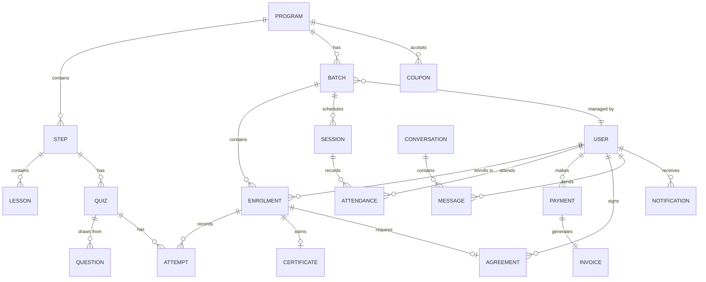
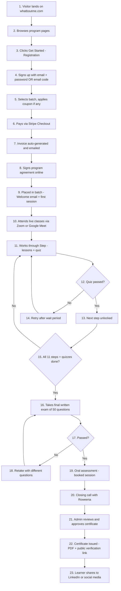
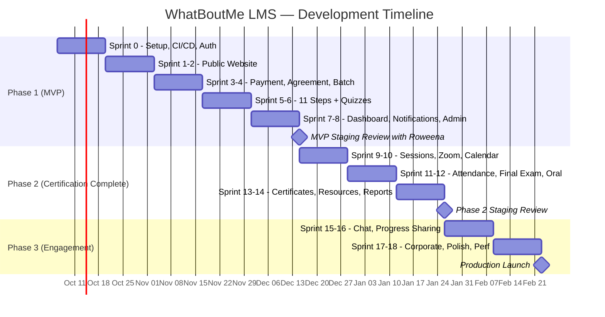

# WhatBoutMe LMS — Product Requirements Document (PRD)

> **Version:** 1.2  
> **Date:** September 29, 2026  
> **Author:** Foxwel.AI  
> **Client:** WhatBoutMe FZE (Roweena Britto)  
> **Domain:** whatboutme.com  
> **Status:** Draft  

### Version History

| Version | Date | Changes |
|---------|------|---------|
| 1.0 | Sep 29, 2026 | Initial PRD from development plan PDF |
| 1.1 | Sep 29, 2026 | Added: single-role rule, invoice config, waitlist flow, lead management, NestJS module map, acceptance criteria, API contracts, error handling, data migration plan |
| 1.2 | Sep 29, 2026 | Added: scope boundaries, feature prioritization (MoSCoW/phasing), RAID, timeline & milestones, data retention policy, WCAG 2.1 AA target, glossary |

---

## Table of Contents

1. [Executive Summary](#1-executive-summary)
2. [Product Vision & Goals](#2-product-vision--goals)
3. [Guiding Principles](#3-guiding-principles)
4. [Target Users & Personas](#4-target-users--personas)
5. [User Roles & Permissions](#5-user-roles--permissions)
6. [Technology Stack & Architecture](#6-technology-stack--architecture)
7. [Core Entities & Data Model](#7-core-entities--data-model)
8. [Learner Journey (End-to-End Flow)](#8-learner-journey-end-to-end-flow)
9. [Feature Specifications](#9-feature-specifications)
   - [9.1 Public Website](#91-public-website)
   - [9.2 Authentication & Onboarding](#92-authentication--onboarding)
   - [9.3 Registration, Payment & Invoicing](#93-registration-payment--invoicing)
   - [9.4 Agreement / E-Signature](#94-agreement--e-signature)
   - [9.5 Course Management (Admin — Roweena's Studio)](#95-course-management-admin--roweenas-studio)
   - [9.6 Batch Management](#96-batch-management)
   - [9.7 The 11 Steps Program (Learning Modules)](#97-the-11-steps-program-learning-modules)
   - [9.8 Resource Library](#98-resource-library)
   - [9.9 Quizzes, Exams & Assessments](#99-quizzes-exams--assessments)
   - [9.10 Live Classes & Sessions](#910-live-classes--sessions)
   - [9.11 Attendance Tracking](#911-attendance-tracking)
   - [9.12 Learner Dashboard & Progress Sharing](#912-learner-dashboard--progress-sharing)
   - [9.13 Certificates](#913-certificates)
   - [9.14 One-on-One Chat](#914-one-on-one-chat)
   - [9.15 Workshops & Corporate Track](#915-workshops--corporate-track)
   - [9.16 Admin Panel & Reporting](#916-admin-panel--reporting)
   - [9.17 Notifications & Reminders](#917-notifications--reminders)
10. [Third-Party Integrations](#10-third-party-integrations)
11. [Content Protection & DRM](#11-content-protection--drm)
12. [Non-Functional Requirements](#12-non-functional-requirements)
13. [Environments & Deployment](#13-environments--deployment)
14. [Handover & Documentation](#14-handover--documentation)
15. [Data Migration Plan](#15-data-migration-plan)
16. [Acceptance Criteria — Key Flows](#16-acceptance-criteria--key-flows)
17. [Error Handling & Edge Cases](#17-error-handling--edge-cases)
18. [API Contract Summary](#18-api-contract-summary)
19. [Appendix — Notification Matrix](#19-appendix--notification-matrix)
20. [Feature Prioritization & MVP Phasing](#20-feature-prioritization--mvp-phasing)
21. [Risks, Assumptions & Dependencies (RAID)](#21-risks-assumptions--dependencies-raid)
22. [Timeline & Milestones](#22-timeline--milestones)
23. [Appendix — Glossary](#23-appendix--glossary)

---

## 1. Executive Summary

WhatBoutMe LMS is a **full-stack, custom-built Learning Management System** for **WhatBoutMe FZE**, the company behind brain-health coach **Roweena Britto**. The platform replaces the existing GoDaddy Website Builder site (`whatboutme.com`) with a modern Next.js website and integrates a custom LMS to run the **"11 Steps to U"** certification program and other courses online.

The platform covers the **entire learner lifecycle**: discovery → registration → payment → agreement signing → batch assignment → live sessions → step-by-step learning → quizzes & exams → certification. An admin panel lets Roweena's team manage everything **without developer involvement**.

---

## 2. Product Vision & Goals

| # | Goal | Success Metric |
|---|------|----------------|
| 1 | Replace GoDaddy with a fully custom, SEO-optimized website | Zero traffic/ranking loss after migration; all existing URLs redirected |
| 2 | Deliver the 11 Steps to U program entirely online | Learners can complete all 11 steps, quizzes, final exam, and receive a certificate |
| 3 | Automate the registration-to-certification pipeline | < 5 minutes of admin time per new learner enrolment |
| 4 | Protect premium content from unauthorized downloads | No direct file URLs; watermarked video/PDF; session limiting |
| 5 | Enable Roweena's team to manage all content and operations without code changes | 100% of course content, pricing, batches, and certificates manageable from admin panel |
| 6 | Support multiple programs (workshops, corporate, certification) | Platform supports N courses with different feature toggles |
| 7 | Support international learners (UAE, India, global) | Multi-currency (INR, AED, USD), multi-timezone |

### 2.1 Scope Boundaries ("Won't Do")

The following are **explicitly out of scope** for this platform. Stating these upfront prevents scope creep and aligns expectations.

| Out of Scope | Rationale |
|---|---|
| **Native mobile apps (iOS/Android)** | Mobile-first responsive web covers the use case. Roweena's learners are on phones but a browser-based PWA avoids App Store review delays and dual codebases. Revisit only if analytics show >30% users requesting native. |
| **Multi-tenant SaaS / white-labeling** | This is a single-tenant platform for WhatBoutMe FZE only. Building multi-tenant adds 3-4× complexity with zero current ROI. |
| **AI-powered features** | No AI chatbot, adaptive learning, or content recommendations. The program is structured and instructor-led — AI adds no value to the certification model at this stage. |
| **Gamification (badges, leaderboards, streaks)** | The 11 Steps program is a professional certification, not a casual learning app. Gamification undermines the professional tone. |
| **SCORM / xAPI / LTI compliance** | Content is custom-built for this platform. No import/export to other LMS systems needed. |
| **Third-party instructor marketplace** | All content is created by Roweena's team. No user-generated courses. |
| **Offline mode / content download** | Requires internet. Offline mode contradicts the content protection requirements. |
| **Multi-language UI** | Platform UI is English-only at launch. Course content is in English. |
| **Advanced analytics / BI dashboards** | Reports cover operational needs. Full BI (cohort analysis, funnel metrics, predictive churn) is a Phase 4+ consideration. |

> **Edge case considered:** "What if a corporate client asks for SCORM export?" — Answer: The platform issues certificates with unique verification URLs. Corporate HR systems can verify via the public `/verify/{certNumber}` page. No SCORM needed.

---

## 3. Guiding Principles

1. **Single Identity** — One login per person; what they see is determined by their role.
2. **Content is View-Only** — Nothing a learner watches or reads should be easy to download.
3. **Everything is Audited** — Every live session, quiz attempt, and payment leaves a record, because certification depends on it.
4. **No-Code Admin** — Admin can change content, batches, questions, pricing, and templates without code changes.
5. **Modular Architecture** — Build modular so new features can plug in later without rework.

---

## 4. Target Users & Personas

### Persona 1: Roweena Britto (Super Admin / Admin)
- **Who:** Brain-health coach, company founder, primary instructor.
- **Needs:** Manage courses, review learner progress, approve certificates, run live sessions, see revenue reports.
- **Pain Points:** Currently using GoDaddy + manual processes; no unified dashboard.

### Persona 2: Team Manager
- **Who:** Staff member assigned to manage specific batches.
- **Needs:** Schedule sessions, mark attendance, communicate with learners, send announcements.
- **Constraints:** Cannot see other managers' batches; cannot change pricing or content.

### Persona 3: Learner (Individual)
- **Who:** Enrolled student pursuing 11 Steps to U certification or a workshop.
- **Needs:** Discover program, pay, sign agreement, attend sessions, work through steps, pass quizzes, get certified.
- **Context:** Primarily mobile users. Located in UAE and India. Various time zones.

### Persona 4: Corporate Participant
- **Who:** Employee whose company has registered a group for a workshop.
- **Needs:** Individual login, attend sessions, receive certificate of participation.
- **Difference:** Company pays; individual learners get their own accounts.

---

## 5. User Roles & Permissions

### 5.1 Role Definitions

| Role | Who | Capabilities |
|------|-----|--------------|
| **Super Admin** | Foxwel.AI & Roweena | **Everything.** Creates courses, registrations, batches, pricing, coupons, invoices. Manages admins, platform settings, integrations (Stripe, Zoom, Outlook, email), certificate templates, agreement templates, audit logs. |
| **Admin** | Roweena & senior staff | Manages programs, the 11 steps, content, quizzes, question bank, batches, pricing, coupons. Approves certificates, grades oral exams, sees all learners, payments, and reports. |
| **Manager** | Team members who run batches | Manages learners and sessions in assigned batches only. Marks attendance, schedules sessions, replies to chats, sends announcements. **Cannot** change pricing, content, or other managers' batches. |
| **User (Learner)** | Enrolled students & corporate participants | Sees only their own dashboard, batch, unlocked steps, sessions, chat, invoices, and certificates. Can share progress. |

### 5.2 Permission Rules

- **Single-role rule:** A person has exactly one role. Super Admin can change a user's role.
- Permissions are stored as **named actions** (e.g., `approve_certificate`, `edit_content`) grouped into roles, so a role can be adjusted later **without code changes**.
- Managers see data **only** for batches they are assigned to.
- Every admin/manager action that changes a learner's status (unlock step, override quiz, approve certificate, refund) is written to an **audit log** with who, what, and when.
- Admin login requires **two-step verification** (email code or authenticator app).
- Role is checked **server-side on every API request** — never trust the client.

### 5.3 Permission Matrix

| Action | Super Admin | Admin | Manager | Learner |
|--------|:-----------:|:-----:|:-------:|:-------:|
| Create/edit courses | ✅ | ✅ | ❌ | ❌ |
| Create/edit batches | ✅ | ✅ | ❌ | ❌ |
| Manage pricing & coupons | ✅ | ✅ | ❌ | ❌ |
| Add/edit content (Roweena's Studio) | ✅ | ✅ | ❌ | ❌ |
| Manage question bank | ✅ | ✅ | ❌ | ❌ |
| Schedule sessions | ✅ | ✅ | ✅ (own batches) | ❌ |
| Mark attendance | ✅ | ✅ | ✅ (own batches) | ❌ |
| Reply to chats | ✅ | ✅ | ✅ (own batches) | ✅ (own threads) |
| Send announcements | ✅ | ✅ | ✅ (own batches) | ❌ |
| Approve certificates | ✅ | ✅ | ❌ | ❌ |
| Grade oral exams | ✅ | ✅ | ❌ | ❌ |
| View all learners & reports | ✅ | ✅ | ❌ | ❌ |
| View own dashboard | ✅ | ✅ | ✅ | ✅ |
| Manage integrations & settings | ✅ | ❌ | ❌ | ❌ |
| Manage other admins/managers | ✅ | ❌ | ❌ | ❌ |
| View audit logs | ✅ | ❌ | ❌ | ❌ |
| Process refunds | ✅ | ✅ | ❌ | ❌ |
| Manually unlock/lock steps | ✅ | ✅ | ❌ | ❌ |
| Override quiz results | ✅ | ✅ | ❌ | ❌ |
| Move learner between batches | ✅ | ✅ | ❌ | ❌ |
| Share progress publicly | ❌ | ❌ | ❌ | ✅ |

---

## 6. Technology Stack & Architecture

> For the full, detailed architecture document (folder structures, database schemas, API endpoints, deployment pipeline, and data flow diagrams), see the companion [ARCHITECTURE.md](file:///c:/Users/lenovo/Desktop/whataboutme/ARCHITECTURE.md).

### 6.1 Stack Overview

| Layer | Technology | Purpose |
|-------|-----------|---------|
| **Frontend** | Next.js (App Router) | Single app with 3 areas: public website, learner portal, admin panel (Roweena's Studio) |
| **Backend API** | NestJS (TypeScript) | RESTful API with modular architecture; role-based access control on every endpoint |
| **ORM** | Prisma | Type-safe database client, migrations, seeding |
| **Database** | AWS RDS (PostgreSQL) | All application data; separate instances for dev/staging/prod |
| **Cache** | AWS ElastiCache (Redis) | Session store, rate limiting, job queue backend |
| **Video Streaming** | Mux / Bunny Stream / Cloudflare Stream | Secure video hosting with signed playback links and domain restriction |
| **Object Storage** | Private bucket (S3-compatible) | PDFs, audio, images, signed agreements, certificates — served via signed links only |
| **Real-time** | WebSockets (via NestJS Gateway using Socket.IO) | Chat and live notifications |
| **Job Queue** | BullMQ (backed by Redis) | Scheduled and slow work: reminders, calendar sync, attendance import, email sending, certificate generation |
| **Auth** | JWT (access + refresh tokens) | Stateless auth with server-side session tracking for device limits |

### 6.2 Architecture Diagram

```
┌────────────────────────────────────────────────────────────┐
│                    BROWSER / MOBILE                         │
│  ┌──────────────┐ ┌──────────────┐ ┌───────────────────┐   │
│  │ Public Site   │ │ Learner      │ │ Admin Panel       │   │
│  │ (SSR/SEO)    │ │ Portal       │ │ (Roweena's Studio)│   │
│  └──────┬───────┘ └──────┬───────┘ └──────┬────────────┘   │
└─────────┼────────────────┼────────────────┼────────────────┘
          │                │                │
          ▼                ▼                ▼
┌────────────────────────────────────────────────────────────┐
│                    NEXT.JS APP (SSR + CSR)                  │
│              Public pages: SSR for SEO                      │
│              Portal/Admin: CSR behind auth                  │
└──────────────────────┬─────────────────────────────────────┘
                       │ API calls only
                       ▼
┌────────────────────────────────────────────────────────────┐
│                    NESTJS API SERVER                        │
│  ┌─────┐ ┌───────┐ ┌────────┐ ┌──────┐ ┌───────────────┐  │
│  │Auth │ │Users  │ │Programs│ │Batch │ │Content        │  │
│  ├─────┤ ├───────┤ ├────────┤ ├──────┤ ├───────────────┤  │
│  │Quiz │ │Exams  │ │Session │ │Attend│ │Payments       │  │
│  ├─────┤ ├───────┤ ├────────┤ ├──────┤ ├───────────────┤  │
│  │Agree│ │Chat   │ │Notify  │ │Certs │ │Reports        │  │
│  └─────┘ └───────┘ └────────┘ └──────┘ └───────────────┘  │
│                    Role check on EVERY request              │
└──────┬──────────┬──────────┬───────────┬───────────────────┘
       │          │          │           │
       ▼          ▼          ▼           ▼
┌──────────┐ ┌─────────┐ ┌──────────┐ ┌──────────────────┐
│ AWS RDS │ │ Stripe  │ │ Zoom /   │ │ Outlook          │
│ Postgres │ │ API     │ │ G-Meet   │ │ (MS Graph)       │
└──────────┘ └─────────┘ └──────────┘ └──────────────────┘
                                         
       ┌──────────────────────────────────────────────────┐
       │                  Job Worker (Bull/BullMQ)         │
       │  Reminders, calendar sync, attendance import,    │
       │  email sending, certificate generation           │
       └──────┬──────────┬──────────┬─────────────────────┘
              │          │          │
              ▼          ▼          ▼
       ┌──────────┐ ┌──────────┐ ┌──────────┐
       │ Email    │ │ Video    │ │ Object   │
       │ Service  │ │ CDN      │ │ Storage  │
       └──────────┘ └──────────┘ └──────────┘
```

### 6.3 NestJS Backend Modules

The backend is split into modules that match the feature list. Each module is a self-contained NestJS module with its own controller, service, and DTOs:

| Module | Responsibility |
|--------|---------------|
| `auth` | Login, signup, JWT, 2FA, session management, password reset |
| `users` | User CRUD, role management, profile, data export/deletion |
| `programs` | Course CRUD, step/module management, feature toggles |
| `batches` | Batch CRUD, learner placement, batch lifecycle |
| `content` | Lesson upload, ordering, Roweena's Studio, resource library |
| `quizzes` | Question bank, step quizzes, final exam, attempt tracking |
| `exams` | Final exam logic, oral assessment rubric and grading |
| `sessions` | Session scheduling, meeting link creation, booking slots |
| `attendance` | Auto-import from Zoom/Meet, manual marking, QR check-in |
| `payments` | Stripe integration, coupons, invoices, refunds |
| `agreements` | Template management, in-app signing, signed PDF storage |
| `chat` | WebSocket conversations, shared inbox, assignment |
| `notifications` | Email + in-app, templates, scheduling, delivery tracking |
| `certificates` | Eligibility check, pending queue, approval, PDF generation |
| `reports` | Dashboard stats, data exports (Excel/CSV) |
| `audit` | Audit log recording and querying |
| `leads` | Enquiry form submissions, lead tracking |
| `calendar` | Microsoft Graph integration, two-way Outlook sync |
| `storage` | Signed URL generation, upload handling, watermarking |

### 6.4 Key Architecture Rules

- **The browser NEVER talks directly to** the database, Stripe, Zoom, or Outlook. Everything goes through the NestJS API.
- **Role checks on the server** for every request — using NestJS Guards with a `@Roles()` decorator.
- **Webhook endpoints** for Stripe (payment confirmation), Zoom/Google Meet (recording & attendance), and the e-signature service. All webhooks verify signatures.
- **WebSocket connection** for real-time chat and live notifications.
- **Request validation** using `class-validator` DTOs on every endpoint.
- **Rate limiting** on auth endpoints and public-facing APIs.

---

## 7. Core Entities & Data Model

### 7.1 Entity Relationship Summary

| Entity | Description | Key Fields | Relationships |
|--------|-------------|------------|---------------|
| **User** | Any person in the system | name, email, phone, country, timezone, role, status, avatar | → Enrolments, Bookings, Chats, Notifications |
| **Program** | A course (e.g., 11 Steps to U, Vision Board Workshop, Corporate Workshop) | name, short_description, long_description, cover_image, category, delivery_mode, duration, cpd_hours, language, price_inr, price_aed, price_usd, features_config | → Steps, Batches, Enrolments |
| **Step (Module)** | One of the 11 steps within a program | title, order, unlock_rule, cpd_hours, status | → Program, Lessons, Quiz |
| **Lesson / Resource** | A video, PDF, or audio item inside a step or resource library | title, type (video/pdf/audio/text), file_url, order, duration, completion_rule | → Step or Library Category |
| **Batch** | A group of learners taking a program together | name, start_date, end_date, capacity, schedule, status | → Program, Manager (User), Enrolments, Sessions |
| **Enrolment** | One learner in one batch | status (active/completed/suspended/cancelled), progress_pct, current_step, cpd_hours_earned | → User, Batch |
| **Quiz** | Assessment at the end of a step | step_id, pass_mark, retry_limit, retry_wait_hours | → Step, Questions |
| **Question** | Individual question in the bank | text, options[], correct_answer, step_tags[], type (MCQ, future types) | → Quiz, Final Exam |
| **Attempt** | One quiz or exam attempt by a learner | questions_shown[], answers[], score, pass_or_fail, started_at, finished_at | → Enrolment, Quiz/Exam |
| **Session** | A live class or 1:1 call | type, datetime, duration, meeting_link, host_id, recording_url, agenda | → Batch or User |
| **Attendance** | Record of who joined a session | join_time, leave_time, minutes_present, source (auto/manual), is_present | → Session, User |
| **Payment** | Stripe payment record | stripe_payment_id, amount, currency, coupon_code, status, payment_method | → User, Enrolment |
| **Invoice** | Generated invoice | invoice_number, amount, currency, tax_fields, pdf_url, status, credit_note_id | → Payment, User, Enrolment |
| **Agreement** | Signed program contract | template_version, signed_pdf_url, signed_at, signer_ip, status | → User, Enrolment |
| **Certificate** | Issued certificate | certificate_number, template_id, issue_date, cpd_hours, approval_status, share_link, pdf_url | → Enrolment |
| **Conversation** | Chat thread | participants[], status (open/resolved), assigned_to | → Users |
| **Message** | Individual chat message | content, attachments[], read_status, sent_at | → Conversation, Sender (User) |
| **Notification** | Email or in-app notification | type, template, channel, schedule, delivery_status, sent_at | → User |
| **Audit Log** | Record of admin/manager actions | actor_id, action, target_entity, target_id, details, timestamp | → User (actor) |
| **Coupon** | Discount code | code, type (percentage/fixed), value, per_course_or_all, usage_limit, used_count, expiry_date | → Program (optional) |

### 7.2 Entity Relationship Diagram



---

## 8. Learner Journey (End-to-End Flow)

The complete learner journey follows these ordered steps:



### Key Decision Points

| Step | Decision | Rule |
|------|----------|------|
| Step 1 access | Agreement signed? | Access locked until agreement is signed |
| Step N+1 unlock | Step N lessons complete + quiz passed? | All lessons must be marked complete AND quiz score ≥ pass mark |
| Final exam eligibility | All 11 step quizzes passed? | Must have passing attempts for all 11 quizzes |
| Certificate eligibility | All steps + all quizzes + final exam + oral assessment + required attendance + closing call | ALL conditions must be met |

---

## 9. Feature Specifications

---

### 9.1 Public Website

**Goal:** Full rebuild of `whatboutme.com`, migrating off GoDaddy Website Builder while preserving the domain and SEO rankings.

#### 9.1.1 Pages to Build

| Page | Content | Notes |
|------|---------|-------|
| **Home** | Three offers (11 Steps to U, Speaker, Vision Board), Roweena's story, client testimonials, certifications & badges, social handles | Keep current section structure |
| **About Me** | Roweena's bio, qualifications, certifications | Redesign |
| **11 Steps to U** | Program details, pricing, CPD hours (25 CPD Hours, UK), open batch dates | Data pulled dynamically from admin panel |
| **Vision Boards** | Workshop details, pricing, dates | Data pulled dynamically from admin panel |
| **Speaker** | Resilience speaker on brain health; speaking topics, past events | Informational |
| **Let's Talk** | Contact form, booking enquiry | Saves leads to admin panel + emails team |
| **Terms & Conditions** | Legal terms | Static page |
| **Privacy Policy** | Privacy policy (UAE/India compliance) | Static page |

#### 9.1.2 Public Website Requirements

- [ ] **SSR (Server-Side Rendering)** for all public pages → SEO optimization
- [ ] **Mobile-first layouts** throughout — most learners will use a phone
- [ ] **Header:** Sign In and Create Account buttons → connect to learner portal (replacing GoDaddy account and bookings pages)
- [ ] **Program pages** pull name, price, dates, and open batches **dynamically from admin panel** — no code change needed to update
- [ ] **"Get Started" buttons** on program pages lead directly to registration flow
- [ ] **Enquiry form** on Let's Talk → saves lead to admin panel + sends email to team
- [ ] **Lead management:** Enquiry submissions stored as leads in admin with status tracking (new, contacted, converted)
- [ ] **Footer:** Coaching disclaimer on every page: *"Not a substitute for professional mental health or medical care"*
- [ ] **Social links:** Instagram, LinkedIn, YouTube
- [ ] **Cookie consent banner**
- [ ] **SEO:** Page titles, meta descriptions, sitemap, Open Graph / social sharing previews
- [ ] **URL Redirects:** Set up 301 redirects for any URLs that change from the GoDaddy site
- [ ] Carry over existing page titles and descriptions so **search ranking is not lost**
- [ ] **Responsive breakpoints:** Desktop (1200px+), Tablet (768px–1199px), Mobile (<768px)

---

### 9.2 Authentication & Onboarding

#### 9.2.1 Sign Up
- [ ] Email + password registration
- [ ] OR passwordless: one-time email code login
- [ ] Capture **country** and **time zone** at sign-up
- [ ] Email verification required

#### 9.2.2 Sign In
- [ ] Email + password
- [ ] OR one-time email code
- [ ] Admin/Manager accounts require **two-step verification** (email code or authenticator app — TOTP)

#### 9.2.3 Session Management
- [ ] Limit active sessions per learner (e.g., **2 devices**)
- [ ] Logging in on a 3rd device **signs out the oldest session**
- [ ] Log unusual activity (e.g., logins from different countries) for admin review

#### 9.2.4 Password Management
- [ ] Forgot password / reset password flow
- [ ] Passwords hashed (bcrypt or argon2)
- [ ] Login rate limiting (brute-force protection)

---

### 9.3 Registration, Payment & Invoicing

#### 9.3.1 Pricing Configuration (Admin)
- [ ] Set one or more prices per course: **INR, AED, USD**
- [ ] **Early bird pricing** with an end date (auto-expires to regular price)
- [ ] Optional **instalment plans** (number of instalments, amount per instalment, due dates)
- [ ] **Coupons:** percentage or fixed amount, per course or all courses, usage limit, expiry date
- [ ] Coupon validation: check expiry, usage count, course applicability before applying

#### 9.3.2 Registration Flow (Learner)
- [ ] Open/close registration per course or per batch
- [ ] Registration deadline and **seat limit** with **waitlist** when full
- [ ] **Waitlist behaviour:** when a seat opens (cancellation/refund), the next person on the waitlist is notified by email with a time-limited payment link
- [ ] Custom registration form fields per course (e.g., company name for corporate, city for in-person workshops)
- [ ] Learner selects a specific batch OR is auto-placed into the next open batch

#### 9.3.3 Payment (Stripe Integration)
- [ ] **Stripe Checkout** for payment processing
- [ ] Support coupon codes at checkout
- [ ] Full payment or instalment options
- [ ] Both INR and AED/USD pricing
- [ ] **Webhook:** Confirm payment via Stripe webhook BEFORE enrolling the learner

#### 9.3.4 Manual Enrolment (Admin)
- [ ] Add a learner manually (offline payment or complimentary seat)
- [ ] Mark the payment method (cash, bank transfer, complimentary)

#### 9.3.5 Corporate Registration
- [ ] One company pays for several participants
- [ ] Each participant gets their own individual login
- [ ] Company-level invoice

#### 9.3.6 Invoicing
- [ ] **Auto-generated** on successful payment
- [ ] Invoice details: WhatBoutMe FZE company details, logo, sequential invoice number
- [ ] **Invoice settings (Super Admin configurable):**
  - Company name, address, registration details
  - Company logo
  - Invoice number **format and sequence** (e.g., `WBM-2026-0001`)
  - Tax fields: VAT for UAE, GST for India (if applicable)
  - Footer notes (e.g., payment terms, bank details)
- [ ] Invoice emailed to learner + stored in their account
- [ ] **Manual invoices** for offline/corporate payments
- [ ] Admin can: view, download, resend, cancel invoices
- [ ] **Credit notes** for refunds (linked to original invoice)
- [ ] Refunds (full or partial) processed through Stripe from admin panel

#### 9.3.7 Payment Reports
- [ ] Payments list with filters: course, batch, date, status, currency
- [ ] **Export to Excel**
- [ ] Revenue summary by course, batch, and month

#### 9.3.8 Registration Status Tracking
- [ ] Admin view of all registrations per course with statuses: Paid, Pending Payment, Agreement Pending, Enrolled, Cancelled, Refunded

---

### 9.4 Agreement / E-Signature

#### 9.4.1 Agreement Flow
- [ ] After payment, learner must sign the program agreement online
- [ ] **Access to Step 1 stays locked until agreement is signed**
- [ ] In-app signing: read agreement → tick consent checkbox → type full name → draw signature
- [ ] Signed PDF generated and stored

#### 9.4.2 Agreement Data Stored
- [ ] Template version used
- [ ] Signed PDF file
- [ ] Signing date and time
- [ ] Signer's IP address
- [ ] Status: pending / signed

#### 9.4.3 Admin Controls
- [ ] Agreement templates are **versioned** in admin
- [ ] Create/edit/publish agreement templates per course
- [ ] View signed agreements per learner

#### 9.4.4 Future Extensibility
- [ ] Architecture should support switching to a **third-party e-sign service** later (e.g., DocuSign, HelloSign) via webhook endpoint

---

### 9.5 Course Management (Admin — Roweena's Studio)

**Goal:** Everything a learner can buy is set up by Super Admin from the panel, with no developer involved. The platform must support many courses, not only 11 Steps to U.

#### 9.5.1 Course CRUD
- [ ] Create, edit, duplicate, publish, unpublish, and archive a course
- [ ] Course details:
  - Name
  - Short description
  - Long description
  - Cover image
  - Category: `certification`, `workshop`, `corporate`
  - Delivery mode: `online`, `in_person`, `hybrid`
  - Duration
  - CPD hours
  - Language

#### 9.5.2 Course Structure
- [ ] Add steps/modules with ordering
- [ ] Add lessons to steps with ordering
- [ ] Add quizzes to steps
- [ ] Define final exam rules
- [ ] Course can have **step-based unlock rules** (like 11 Steps) OR be a **simple open course** (like a one-day workshop)

#### 9.5.3 Feature Toggles per Course
- [ ] Toggle ON/OFF per course:
  - Quizzes
  - Final exam
  - Oral assessment
  - Attendance requirement
  - Agreement required
  - Certificate type (certification vs. participation)

#### 9.5.4 Template Assignment
- [ ] Assign a certificate template per course
- [ ] Assign an agreement template per course

#### 9.5.5 Auto Publishing
- [ ] Each published course automatically gets its own page on the public website

#### 9.5.6 Content Management (Roweena's Studio)
- [ ] Upload content: video, PDF, audio, text
- [ ] **Drag and drop reordering** of steps and lessons
- [ ] Preview as a learner
- [ ] Publish or keep as draft
- [ ] Content status: draft / published

---

### 9.6 Batch Management

#### 9.6.1 Batch CRUD
- [ ] Create batches under a course
- [ ] Batch details: name (e.g., "11 Steps, Oct 2026"), program, start date, capacity, assigned manager, session schedule
- [ ] Each batch can have its own price (if different from course default)

#### 9.6.2 Learner Placement
- [ ] New paid learners auto-placed into the open batch
- [ ] OR manually placed by admin
- [ ] Move a learner between batches **without losing progress**

#### 9.6.3 Batch Features
- [ ] Own session calendar
- [ ] Own announcements
- [ ] Own attendance sheet
- [ ] Own progress view (all learners' progress in the batch)

#### 9.6.4 Batch Lifecycle
- [ ] Status: open, in_progress, closed, archived
- [ ] Close or archive a finished batch

#### 9.6.5 Batch-Wide Actions
- [ ] Send announcement to all learners in batch
- [ ] Send reminder to all learners in batch
- [ ] Export attendance for batch (Excel/CSV)
- [ ] Export progress for batch (Excel/CSV)

---

### 9.7 The 11 Steps Program (Learning Modules)

#### 9.7.1 Structure
- [ ] Program built as **11 steps**
- [ ] Each step holds **lessons** (video, PDF, audio, text) in a **set order**
- [ ] Each step has a **10-question quiz** at the end

#### 9.7.2 Step Unlock Rules
- [ ] **Default rule:** Next step opens ONLY when:
  1. Previous step's lessons are all marked complete, AND
  2. Previous step's quiz is passed
- [ ] **Date-based release:** Admin can optionally set a date-based release per batch
- [ ] **Manual override:** Admin can manually unlock or re-lock a step for one learner, with a **logged reason**

#### 9.7.3 Lesson Completion Tracking
- [ ] **Video:** Watched to a configurable percentage (e.g., 80%) — tracked via player progress events, not just page open
- [ ] **PDF:** Opened and scrolled through (page-level tracking)
- [ ] **Audio:** Played to a configurable percentage — tracked via audio player progress events
- [ ] **Text:** Explicitly marked as read by the learner (click "Mark as Complete")
- [ ] Completion state stored per learner per lesson (not started / in progress / complete)
- [ ] Admin can see completion status for every learner on every lesson

#### 9.7.4 Content Management
- [ ] All managed in **Roweena's Studio** (admin panel)
- [ ] Upload, reorder (drag & drop), preview as learner, publish/draft

---

### 9.8 Resource Library

#### 9.8.1 Structure
- [ ] Separate library of extra material: worksheets, readings, guided audios
- [ ] Organised by **category**
- [ ] Tagged by **step**

#### 9.8.2 Access Control
- [ ] Access can be set per:
  - Program
  - Batch
  - Step

#### 9.8.3 Content Protection
- [ ] **View-only:** No download buttons
- [ ] Files open inside the **platform viewer**
- [ ] See Content Protection section for full details

---

### 9.9 Quizzes, Exams & Assessments

#### 9.9.1 Question Bank
- [ ] Managed by admin
- [ ] Questions tagged by step
- [ ] **Multiple choice** to start
- [ ] Architecture should support future question types (true/false, short answer, etc.)
- [ ] Fields: question text, options[], correct_answer, step_tags[]

#### 9.9.2 Step Quizzes
- [ ] **10 questions** per step quiz
- [ ] Pass mark set by admin (e.g., 70%)
- [ ] Retry limit set by admin (e.g., 3 attempts)
- [ ] Wait time between retries set by admin (e.g., 24 hours)
- [ ] Questions can be drawn randomly from bank (tagged by step)

#### 9.9.3 Final Written Exam
- [ ] **50 questions** drawn and shuffled from the question bank
- [ ] Each retake gives a **different paper** (randomized)
- [ ] **Time limit** set by admin
- [ ] Pass mark set by admin

#### 9.9.4 Oral Assessment
- [ ] Booked as a session (1:1 with Roweena or admin)
- [ ] Scored by admin against a **simple rubric**
- [ ] Admin notes stored on the learner's record
- [ ] Pass/fail determined by admin

#### 9.9.5 Results Display
- [ ] **Learner sees:** Score and which step to revisit (for failed questions)
- [ ] **Admin sees:** Results per learner and per batch
- [ ] Results exportable

---

### 9.10 Live Classes & Sessions

#### 9.10.1 Session Scheduling
- [ ] Admin or manager schedules a session for a batch
- [ ] Admin or manager books a 1:1 session
- [ ] Meeting link (Zoom or Google Meet) **created automatically**
- [ ] Session added to **Roweena's Outlook calendar** automatically

#### 9.10.2 Booking Types

| Type | Duration | Naming |
|------|----------|--------|
| 11 Steps Welcome Call | Fixed | Auto-named |
| 11 Steps Closing Call | Fixed | Auto-named |
| 1:1 with Ro | Fixed | Auto-named |
| Vision Board Workshop (Online) | Fixed | Auto-named |
| Vision Board Workshop (In Person) | Fixed | Auto-named |
| Vision Board Online | Fixed | Auto-named |
| Speaker Discovery Call | Fixed | Auto-named |

#### 9.10.3 Learner Booking
- [ ] Learners book slots from Roweena's **available times**
- [ ] Times shown in **learner's own time zone**
- [ ] Availability reads from Outlook — a **clash in Outlook blocks that slot** on the site (two-way sync)

#### 9.10.4 Reschedule & Cancellation
- [ ] Reschedule and cancel rules set by admin (e.g., cancel up to 24h before)

#### 9.10.5 Session Page (Learner View)
- [ ] **Join button** — active shortly before session start time
- [ ] Agenda and materials for the session

#### 9.10.6 Recordings
- [ ] After the session, admin uploads the recording OR it is **pulled from Zoom automatically**
- [ ] Recordings play in the **view-only player** for that batch only

---

### 9.11 Attendance Tracking

#### 9.11.1 Automatic (Online Sessions)
- [ ] Attendance pulled from **Zoom or Google Meet participant report** after the meeting
- [ ] Data captured: join time, leave time, minutes present
- [ ] Match participants to learners **by email**
- [ ] Unmatched names go to a **review list** for manager to manually link

#### 9.11.2 Minimum Attendance Rule
- [ ] Configurable by admin (e.g., 75% of session time = "present")
- [ ] Binary result: present / absent

#### 9.11.3 In-Person Attendance
- [ ] **Check-in link** or **QR code** marks attendance for in-person workshops

#### 9.11.4 Manual Corrections
- [ ] Manager can correct attendance manually with a **logged reason**

#### 9.11.5 Attendance and Certificate Eligibility
- [ ] Attendance feeds into **certificate eligibility** calculation
- [ ] Attendance visible on **learner's dashboard**

---

### 9.12 Learner Dashboard & Progress Sharing

#### 9.12.1 Dashboard (Single Screen)
- [ ] **Current step** in the program
- [ ] **Progress percentage** (overall)
- [ ] **CPD hours earned**
- [ ] **Next upcoming session**
- [ ] **Pending quiz** (if any)
- [ ] **Invoices**
- [ ] **Agreement status**
- [ ] **Certificates**

#### 9.12.2 Progress Sharing
- [ ] Learner can generate a **public link** or **image card** showing milestones
  - Example: *"Completed Step 6 of 11"*
- [ ] Share to **LinkedIn**, **Instagram**, or **WhatsApp**
- [ ] Learner **chooses what the share shows** — nothing is public unless they explicitly create a share

#### 9.12.3 Certificate Verification
- [ ] Certificates have a **public verification page** accessible by certificate number
- [ ] **"Add to LinkedIn profile"** button on certificate

---

### 9.13 Certificates

#### 9.13.1 Eligibility Criteria (Certification Programs)
ALL of the following must be complete:
- [ ] All 11 steps completed
- [ ] All step quizzes passed
- [ ] Final written exam passed
- [ ] Oral assessment passed
- [ ] Required attendance met
- [ ] Closing call completed

#### 9.13.2 Approval Workflow
- [ ] Eligible certificates go to a **pending list**
- [ ] Admin manually reviews and **approves** each certificate
- [ ] Only approved certificates are issued to the learner

#### 9.13.3 Certificate Content
- [ ] Learner name
- [ ] Program name
- [ ] Date of completion
- [ ] CPD hours
- [ ] Unique certificate number
- [ ] Generated as **PDF**

#### 9.13.4 Certificate Templates
- [ ] Admin uploads and manages certificate templates
- [ ] Different templates for different programs

#### 9.13.5 Corporate Workshop Certificates
- [ ] Separate **certificate of participation**
- [ ] No exam or CPD hours required
- [ ] Simpler issuance flow

#### 9.13.6 Certificate Sharing
- [ ] Public verification page by certificate number
- [ ] "Add to LinkedIn" button
- [ ] Downloadable PDF

---

### 9.14 One-on-One Chat

#### 9.14.1 Chat Features
- [ ] Private chat between a learner and the team (Roweena, admins, batch manager)
- [ ] **Text messages**
- [ ] **Emoji support**
- [ ] **File and image attachments**
- [ ] **Read receipts**
- [ ] **Typing indicator**
- [ ] **Real-time** via WebSockets

#### 9.14.2 Staff Inbox
- [ ] Staff see a **shared inbox** of all learner conversations
- [ ] Can **assign a chat** to a specific team member
- [ ] Can **mark it resolved**

#### 9.14.3 Notifications
- [ ] New message alerts **in-app**
- [ ] **Email notification** if message unread after a configurable time

#### 9.14.4 History
- [ ] Full chat history kept on the learner's record
- [ ] Searchable by admin

---

### 9.15 Workshops & Corporate Track

#### 9.15.1 Vision Board Workshop
- [ ] Registration flow: online or in-person option
- [ ] Own payment processing
- [ ] Own check-in (in-person: QR code/link)
- [ ] Simpler structure — no step-based unlocking

#### 9.15.2 Corporate Workshop
- [ ] Company registers and pays for a group
- [ ] Each participant gets their own login
- [ ] Attendance tracked
- [ ] **Certificate of participation** issued (no exam, no CPD hours)

---

### 9.16 Admin Panel & Reporting

#### 9.16.1 Admin Dashboard
- [ ] **Active learners** count
- [ ] **Revenue** summary
- [ ] **New enrolments** count
- [ ] **Batches in progress** count
- [ ] **Pending certificates** count
- [ ] **Unread chats** count

#### 9.16.2 Learner Profile View
- [ ] **Everything about one person in one place:**
  - Personal details
  - Enrolments
  - Progress per program
  - Quiz/exam results
  - Attendance records
  - Payment history & invoices
  - Agreement status
  - Certificates
  - Chat history
  - Audit log entries

#### 9.16.3 Reports (with Export)
All reports exportable to **Excel or CSV**:

| Report | Description |
|--------|-------------|
| Payments | Filterable by course, batch, date, status, currency |
| Attendance by Batch | Per session and per learner |
| Quiz & Exam Results | Per learner and per batch |
| Progress by Batch | All learners' completion status |
| Certificates Issued | With status (pending/approved) |
| Revenue Summary | By course, batch, and month |

---

### 9.17 Notifications & Reminders

#### 9.17.1 Notification Channels
- [ ] **Email** — using editable templates in admin
- [ ] **In-app** — notification bell in the portal

#### 9.17.2 Template Management
- [ ] Admin can edit: subject, body for each notification type
- [ ] Admin can turn each notification type ON or OFF
- [ ] Send times respect the **learner's time zone**

#### 9.17.3 Learner Preferences
- [ ] Learners can turn off **non-essential** emails
- [ ] **Payment, agreement, and session emails always send** (cannot be disabled)

#### 9.17.4 Admin Announcements
- [ ] Send a manual announcement to:
  - One learner
  - A batch
  - Everyone

#### 9.17.5 Email Delivery Tracking
- [ ] Log every email sent
- [ ] Track delivery status (sent, delivered, bounced, failed)

---

## 10. Third-Party Integrations

All accounts are **owned by WhatBoutMe** and paid by the client at actual cost. API keys are stored as **server secrets, never in the front end**.

| Service | Used For | Integration Notes |
|---------|----------|-------------------|
| **Stripe** | Checkout, coupons, invoices, refunds | Client already uses Stripe in Dubai. Use webhooks to confirm payment before enrolling. |
| **Zoom or Google Meet** | Creating meeting links, recordings, participant reports for attendance | Build behind one **"meeting provider" abstraction layer** so either can be switched on. |
| **Microsoft Outlook (Microsoft Graph API)** | Adding sessions to Roweena's calendar, reading her busy times for booking slots | **Two-way sync:** A clash in Outlook blocks that slot on the site. |
| **Email Delivery Service** (e.g., SendGrid, Resend, AWS SES) | All transactional and reminder emails | Use a proper sending domain on `whatboutme.com` with **SPF and DKIM** configured. |
| **Secure Video Streaming** (Mux, Bunny Stream, or Cloudflare Stream) | Hosting lesson videos and recordings | Needs **signed playback links** and **domain restriction**. |
| **Object Storage** (S3-compatible) | PDFs, audio, images, signed agreements, certificates | **Private bucket**, files served via **signed links only**. |
| **E-Signature Service** (optional, future) | Legal-grade signing if in-app signing is not enough | Not needed at launch. In-app signing is used. Webhook endpoint ready. |

---

## 11. Content Protection & DRM

> **Important Expectation Setting:** No web platform can fully stop a determined person from screen-recording, so the goal is to **make downloading hard and sharing traceable**. Set this expectation with the client.

### 11.1 Video Protection
- [ ] Stream through video service with **short-lived signed links** — never a direct file URL
- [ ] Restrict playback to **`whatboutme.com` domain only** — embed links do not work elsewhere
- [ ] Custom player with **no download option** and **no right-click menu**
- [ ] **Moving watermark** over the video with the learner's **name or email** — so any leak can be traced
- [ ] Consider DRM from the video provider later if leaks become a real problem

### 11.2 PDF & Audio Protection
- [ ] Shown in an **in-app viewer** (PDF rendered page-by-page) — no download or print button
- [ ] Files served through the API with **short-lived signed links**
- [ ] Only served to **logged-in learners with access to that step**
- [ ] Light **watermark with the learner's name** on PDF pages

### 11.3 Account Sharing Prevention
- [ ] Limit active sessions per learner (e.g., **2 devices**)
- [ ] Logging in on a 3rd device signs out the oldest
- [ ] Log unusual activity (many logins from different countries) for admin review

---

## 12. Non-Functional Requirements

### 12.1 Security
- [ ] Passwords hashed (bcrypt or argon2)
- [ ] Login rate limiting
- [ ] Role-based access control checked **on the server for every request**
- [ ] **HTTPS only**
- [ ] Secrets stored in environment variables, never in frontend code
- [ ] Input validation on every form (client-side AND server-side)
- [ ] CSRF protection
- [ ] SQL injection prevention (use parameterized queries / ORM)

### 12.2 Privacy
- [ ] Learners are in UAE and India — comply with relevant data protection laws
- [ ] Store **only what is needed** (data minimization)
- [ ] Let a learner **download** their data on request
- [ ] Let a learner **delete** their data on request (right to erasure)
- [ ] Maintain a **privacy policy** and **terms** page

### 12.3 Performance
- [ ] Pages usable on **mid-range phones on mobile data**
- [ ] Lazy-load video content
- [ ] Compress and optimize images
- [ ] SSR for public pages (fast first paint)
- [ ] Target: less than 3 second page load on 3G connection

### 12.4 Time Zones
- [ ] Store all times in **UTC** in the database
- [ ] Display times in **each user's own time zone**

### 12.5 Currency
- [ ] Support **INR** and **AED/USD** pricing per program
- [ ] Display correct currency based on program / learner location

### 12.6 Backups
- [ ] **Daily database backups** with point-in-time restore (AWS RDS supports this natively)
- [ ] **Test a restore before go-live**

### 12.7 Monitoring & Alerts
- [ ] Error tracking on frontend (e.g., Sentry)
- [ ] Error tracking on API (e.g., Sentry)
- [ ] Uptime checks
- [ ] Alerts sent to Foxwel.AI team

### 12.8 Accessibility

**Target:** WCAG 2.1 Level AA compliance.

> **Why AA and not AAA?** AAA is aspirational and often impractical (e.g., requires 7:1 contrast ratio which conflicts with brand colors). AA is the legally defensible standard used by most EdTech platforms.

- [ ] Readable font sizes (minimum 16px body text)
- [ ] Caption support on videos (manual captions; auto-caption as future enhancement)
- [ ] Keyboard-navigable forms and interactive elements (tab order, focus indicators)
- [ ] Sufficient color contrast (4.5:1 for normal text, 3:1 for large text per WCAG AA)
- [ ] Semantic HTML with ARIA labels for screen readers
- [ ] Skip-to-content link on all pages
- [ ] Form error messages associated with fields via `aria-describedby`
- [ ] Alt text for all meaningful images
- [ ] Focus trap management in modals (quiz modal, agreement signing modal)

> **Edge case:** A visually impaired learner in India uses NVDA screen reader. The quiz form must announce questions, options, and results correctly. The signature pad (agreement signing) needs a keyboard-accessible alternative (typed name fallback).

### 12.9 Data Retention Policy

| Data Type | Retention Period | Rationale |
|-----------|-----------------|----------|
| **User accounts** | Active until deletion request | PDPL (UAE) right to erasure |
| **Enrolment & progress** | 7 years after completion | Certificate verification depends on it |
| **Payment records & invoices** | 7 years | UAE Commercial Companies Law; tax audit requirements |
| **Audit logs** | 5 years | Certification integrity; dispute resolution |
| **Chat messages** | 3 years after conversation resolved | Support reference; can be purged on request |
| **Session recordings** | 2 years after batch archived | Storage cost management; batch reference |
| **Agreement signed PDFs** | Indefinite (or until legal counsel advises) | Contractual obligation proof |
| **Certificates** | Indefinite | Public verification must always work |
| **Leads (enquiry form)** | 2 years if not converted | PDPL data minimization |
| **Expired JWT tokens / sessions** | Auto-purged nightly | Cleanup job handles this |

> **Edge case (data deletion request):** Learner requests full data deletion under UAE PDPL. **Action:** Soft-delete user profile, anonymize audit logs (`actor: "deleted_user_abc123"`), revoke active certificates, but **retain invoice records** (legal compliance) and **anonymized enrolment data** (aggregate reporting).

---

## 13. Environments & Deployment

| Environment | Purpose | URL |
|-------------|---------|-----|
| **Development** | Active development and testing | Local / dev server |
| **Staging** | Live preview for Roweena to review before production | Staging URL (e.g., `staging.whatboutme.com`) |
| **Production** | Live site | `whatboutme.com` |

- AWS RDS PostgreSQL: use **separate instances** for dev, staging, and production databases.
- CI/CD pipeline for automated testing and deployment.
- **Deployment strategy:** Zero-downtime deployments using rolling updates.
- **Environment variables:** Managed via `.env` files locally, secure secrets manager in production.
- **Branch protection:** `main` branch requires PR review before merge.

---

## 14. Handover & Documentation

- [ ] **Source code** in a repository owned by the client (or shared with them)
- [ ] **Setup guide** — how to run locally, deploy, and configure
- [ ] **Admin user guide** — how to use every feature in the admin panel
- [ ] **Training session** for Roweena's team
- [ ] **API documentation** for future developers

---

## 15. Data Migration Plan

Since we are migrating from GoDaddy Website Builder, the following must be handled:

| Item | Action | Priority |
|------|--------|----------|
| Domain (`whatboutme.com`) | Transfer DNS to new hosting; point A/CNAME records | 🔴 Critical |
| Existing page URLs | Map every GoDaddy URL → new URL; set 301 redirects | 🔴 Critical |
| SEO metadata | Export current page titles, meta descriptions, and sitemap; replicate exactly | 🔴 Critical |
| Content (text, images) | Extract all text and images from current site pages | 🟡 High |
| Google Search Console | Verify new site, submit new sitemap, monitor indexing | 🟡 High |
| Google Analytics | Transfer or re-configure tracking on new site | 🟡 High |
| Existing bookings/accounts | GoDaddy bookings data — confirm if any needs migrating or if starting fresh | 🟢 Medium |
| Email setup | Configure SPF, DKIM, DMARC on whatboutme.com for transactional emails | 🔴 Critical |

---

## 16. Acceptance Criteria — Key Flows

### 16.1 Registration & Payment Flow

```
GIVEN a visitor on a program page
WHEN they click "Get Started"
THEN they are taken to the registration page

GIVEN a new user registering
WHEN they enter email + password + country + timezone
THEN their account is created, verification email is sent
AND they cannot access the portal until email is verified

GIVEN a verified user on the registration page
WHEN they select a batch and complete Stripe Checkout
THEN a Stripe webhook confirms payment
AND an invoice is auto-generated with the correct WBM format
AND the invoice is emailed and stored in their account
AND their status becomes "Agreement Pending"

GIVEN a paid user who has not signed the agreement
WHEN they try to access Step 1 content
THEN they are redirected to the agreement signing page
AND Step 1 remains locked

GIVEN a user who has signed the agreement
WHEN they return to the dashboard
THEN Step 1 is unlocked and accessible
AND they receive a welcome email with batch details
```

### 16.2 Step Unlock Flow

```
GIVEN a learner on Step N
WHEN they have completed all lessons (video ≥ 80%, PDF opened, audio played, text marked read)
AND they have passed the Step N quiz (score ≥ pass mark)
THEN Step N+1 is automatically unlocked
AND a "New Step Unlocked" notification is sent

GIVEN a learner who fails a quiz
WHEN they have retries remaining AND the wait period has elapsed
THEN they can retake the quiz
AND questions may be re-drawn from the bank

GIVEN a learner who has exhausted all retries
THEN admin is notified
AND admin can manually override the quiz result with a logged reason
```

### 16.3 Certificate Issuance Flow

```
GIVEN a learner who has:
  - Completed all 11 steps
  - Passed all 11 step quizzes
  - Passed the final written exam
  - Passed the oral assessment
  - Met the minimum attendance requirement
  - Completed the closing call
THEN a certificate record is created with status "pending"
AND it appears in the admin's pending certificates list

GIVEN an admin reviewing a pending certificate
WHEN they approve it
THEN a PDF certificate is generated with: name, program, date, CPD hours, certificate number
AND the learner is notified
AND a public verification page is created at /verify/{certificate_number}
```

### 16.4 Attendance Sync Flow

```
GIVEN an online session has ended
WHEN the Zoom/Meet webhook fires OR a scheduled job runs
THEN participant data (email, join time, leave time, duration) is pulled
AND each participant is matched to a learner by email
AND if minutes_present ≥ (session_duration × attendance_threshold), mark as "present"
AND unmatched participants appear in the manager's review list
```

---

## 17. Error Handling & Edge Cases

| Scenario | Expected Behaviour |
|----------|-------------------|
| Stripe payment fails mid-checkout | Learner sees error message; no enrolment created; admin sees "Pending Payment" status |
| Stripe webhook arrives late (>5 min) | Learner sees "Payment Processing" state; webhook handler is idempotent — processes only once |
| Learner tries to access a locked step | Redirect to current step with clear message about what's needed to unlock |
| Quiz submitted after time limit expires | Submission rejected; attempt marked as timed out; counts toward retry limit |
| Learner's session token is on 3rd device | Oldest session is invalidated; user on oldest device sees "Signed out on another device" |
| Manager tries to access another manager's batch | 403 Forbidden — role guard blocks at API level |
| Coupon code is expired or over usage limit | Clear error at checkout: "This coupon is no longer valid" |
| Batch is full when learner tries to register | Learner is placed on waitlist; shown position in queue |
| Waitlisted learner doesn't pay within time limit | Seat offered to next person on waitlist |
| Zoom meeting link creation fails | Session is created without link; admin is notified to add link manually |
| PDF watermarking fails | Serve un-watermarked PDF to avoid blocking learner; log error for admin |
| Email delivery fails | Retry up to 3 times with exponential backoff; log failure; admin can resend manually |
| Admin approves certificate but PDF generation fails | Certificate stays in "pending" state; admin is notified; can retry generation |
| Concurrent quiz submission (double-click) | Idempotent handler — only first submission is processed |
| Learner requests data deletion | Soft-delete user data; anonymize audit logs; revoke certificates; retain invoice data for legal compliance |

---

## 18. API Contract Summary

High-level API groups. Full endpoint specs in [ARCHITECTURE.md](file:///c:/Users/lenovo/Desktop/whataboutme/ARCHITECTURE.md).

| Method | Endpoint Pattern | Module | Auth Required |
|--------|-----------------|--------|:-------------:|
| `POST` | `/api/auth/signup` | Auth | ❌ |
| `POST` | `/api/auth/login` | Auth | ❌ |
| `POST` | `/api/auth/verify-email` | Auth | ❌ |
| `POST` | `/api/auth/forgot-password` | Auth | ❌ |
| `POST` | `/api/auth/2fa/verify` | Auth | ✅ |
| `GET/PUT` | `/api/users/me` | Users | ✅ |
| `GET/POST/PUT/DELETE` | `/api/programs/*` | Programs | ✅ (Admin+) |
| `GET/POST/PUT/DELETE` | `/api/batches/*` | Batches | ✅ (Admin+) |
| `GET/POST/PUT` | `/api/content/*` | Content | ✅ (Admin+) |
| `GET/POST` | `/api/quizzes/*` | Quizzes | ✅ |
| `POST` | `/api/quizzes/:id/attempt` | Quizzes | ✅ (Learner) |
| `GET/POST` | `/api/sessions/*` | Sessions | ✅ |
| `POST` | `/api/sessions/:id/book` | Sessions | ✅ (Learner) |
| `GET/POST/PUT` | `/api/attendance/*` | Attendance | ✅ (Manager+) |
| `POST` | `/api/payments/checkout` | Payments | ✅ |
| `POST` | `/api/payments/webhook` | Payments | ❌ (Stripe signature) |
| `GET/POST` | `/api/invoices/*` | Payments | ✅ |
| `GET/POST` | `/api/agreements/*` | Agreements | ✅ |
| `POST` | `/api/agreements/:id/sign` | Agreements | ✅ (Learner) |
| `WS` | `/api/chat` | Chat | ✅ |
| `GET` | `/api/notifications` | Notifications | ✅ |
| `GET/POST` | `/api/certificates/*` | Certificates | ✅ (Admin+) |
| `GET` | `/api/verify/:certNumber` | Certificates | ❌ (Public) |
| `GET` | `/api/reports/*` | Reports | ✅ (Admin+) |
| `GET` | `/api/audit-log` | Audit | ✅ (Super Admin) |
| `GET/POST` | `/api/leads/*` | Leads | ✅ (Admin+) |
| `POST` | `/api/leads/enquiry` | Leads | ❌ (Public form) |

---

## 19. Appendix — Notification Matrix

| # | Trigger | Recipient | Timing | Channel | Mandatory? |
|---|---------|-----------|--------|---------|:----------:|
| 1 | Sign-up / email verification | Learner | Immediately | Email | ✅ |
| 2 | Password reset | Learner | Immediately | Email | ✅ |
| 3 | Payment received + invoice | Learner + Admin copy | Immediately | Email + In-app | ✅ |
| 4 | Payment failed | Learner | On failure | Email + In-app | ✅ |
| 5 | Instalment due | Learner | 7 days + 1 day before due date | Email + In-app | ✅ |
| 6 | Agreement pending signature | Learner | After payment; follow-up after 24h and 72h if unsigned | Email + In-app | ✅ |
| 7 | Welcome to batch | Learner | On batch assignment | Email + In-app | ❌ |
| 8 | Session reminder with join link | Attendees | 24 hours and 1 hour before | Email + In-app | ✅ |
| 9 | Booking confirmed | Learner + Host | Immediately | Email + In-app | ✅ |
| 10 | Booking rescheduled | Learner + Host | Immediately | Email + In-app | ✅ |
| 11 | Booking cancelled | Learner + Host | Immediately | Email + In-app | ✅ |
| 12 | New step unlocked | Learner | On unlock | Email + In-app | ❌ |
| 13 | Inactivity nudge | Learner | After N days with no progress (configurable) | Email | ❌ |
| 14 | Quiz or exam result | Learner | After submission | Email + In-app | ❌ |
| 15 | Missed session / recording available | Learner | After the session | Email + In-app | ❌ |
| 16 | New chat message | Recipient | If unread after configurable time (default: 5 min) | Email | ❌ |
| 17 | Certificate issued | Learner | On admin approval | Email + In-app | ❌ |
| 18 | Daily summary | Admin + Managers | Each morning (in their timezone) | Email | ❌ |
| 19 | Waitlist seat available | Waitlisted learner | When a seat opens | Email + In-app | ✅ |

> **Mandatory (✅):** Always sends. Learner cannot disable.  
> **Non-mandatory (❌):** Learner can opt out of email; still appears in-app notification bell.

---

## 20. Feature Prioritization & MVP Phasing

Features classified using **MoSCoW** methodology, mapped to development phases. Prioritization is based on the PDF's learner journey — if a feature blocks a learner from completing the certification flow, it's Phase 1.

### Phase 1 — Must-Have (MVP) 🔴

> **Goal:** A learner can discover the program, pay, sign agreement, complete all 11 steps with quizzes, and see their progress. Admin can set up and manage everything.

| Feature | Why It's Phase 1 (Real-World Justification) |
|---------|------|
| Public Website (§9.1) | The GoDaddy site must be replaced before anything else works. No website = no discovery = no revenue. |
| Authentication & Onboarding (§9.2) | Learners cannot access any portal feature without auth. Every other feature depends on this. |
| Registration, Payment & Invoicing (§9.3) | Revenue-critical. Without Stripe checkout, no enrolments happen. Invoice is legally required for UAE business. |
| Agreement / E-Signature (§9.4) | PDF requirement: "Access to Step 1 stays locked until signed." Blocks the entire learning flow. |
| Course Management / Roweena's Studio (§9.5) | Admin must create the course and upload content before any learner can access it. Chicken-and-egg dependency. |
| Batch Management (§9.6) | Learners are grouped in batches. Without batches, there's no cohort structure. |
| 11 Steps Program — Content & Step Locking (§9.7) | THE core product. This is what learners are paying for. |
| Step Quizzes (§9.9.1–§9.9.2) | Step unlocking depends on passing quizzes. Without quizzes, all steps would be open (violates the certification model). |
| Learner Dashboard (§9.12.1) | Learners need to see their progress, next session, pending quiz. This is the "home screen" of the product. |
| Notifications — Critical Subset (§9.17) | Only: signup/verification, payment confirmation, agreement reminder, step unlocked. Without these, learners get lost. |
| Admin Panel — Core Dashboard + Learner Profile (§9.16.1–2) | Roweena needs to see who enrolled, their progress, and manage them. |

### Phase 2 — Should-Have (Pre-First-Batch-Completion) 🟡

> **Goal:** First batch can fully complete the program and receive certificates. Live sessions and full assessment pipeline working.

| Feature | Why It's Phase 2 (Not MVP) |
|---------|------|
| Live Sessions & Zoom/Meet Integration (§9.10) | Needed before the first live class, but NOT for initial platform setup. A batch might not start for 2-4 weeks after launch. |
| Attendance Tracking (§9.11) | Required for certificate eligibility, but only relevant when live sessions happen. |
| Final Written Exam (§9.9.3) | Only needed when a learner finishes all 11 steps. That's weeks into the program. |
| Oral Assessment (§9.9.4) | Same — happens near program end. |
| Certificates (§9.13) | End-of-program feature. First certificate won't be issued until 3-4 months after launch. |
| Resource Library (§9.8) | Supplementary material. Learners can progress through steps without it. |
| Reports & Export (§9.16.3) | Roweena won't need revenue reports until the first batch completes. |
| Full Notification Matrix (§9.17) | Remaining 15 notification types. Non-critical triggers can be added incrementally. |

### Phase 3 — Could-Have (Engagement & Polish) 🟢

> **Goal:** Engagement features, corporate track, and operational polish.

| Feature | Why It Can Wait |
|---------|------|
| One-on-One Chat (§9.14) | Real-world: Roweena currently uses WhatsApp for learner communication. Chat is a convenience, not a blocker. |
| Progress Sharing & Social (§9.12.2) | Engagement/marketing feature. No learner is blocked without it. |
| Workshops & Corporate Track (§9.15) | Separate product line. Roweena's priority is 11 Steps to U, not workshops. |
| Advanced Content Protection (DRM) | Basic watermarks + signed URLs ship in Phase 1. DRM only if leaks actually occur. |
| Waitlist with Auto-Advancement | Manual waitlist management initially. Auto-advancement is an optimization for scale. |
| Instalment Plans | Full payment first. Instalments are complex (failed payment edge cases, partial refunds, grace periods) and affect <10% of learners. |

> **Edge case validated:** "What if a learner finishes all 11 steps in Phase 1 but certificates aren't built yet?" → Admin manually issues certificate via email. This works for the first 1-2 completions while Phase 2 is built. The system tracks eligibility, so no data is lost.

---

## 21. Risks, Assumptions & Dependencies (RAID)

### 21.1 Risks

| # | Risk | Likelihood | Impact | Mitigation | Real-World Scenario |
|---|------|:----------:|:------:|------------|----|
| R1 | **SEO ranking drop during GoDaddy → Next.js migration** | Medium | High | Set up 301 redirects for every URL. Carry over exact page titles and meta descriptions. Submit new sitemap to Google Search Console day 1. Monitor rankings for 30 days. | Google re-crawl typically takes 2-4 weeks. Even with perfect redirects, temporary ranking fluctuation is normal. |
| R2 | **Stripe webhook delivery delay (>5 min)** | Low | Medium | Show "Payment Processing" state. Webhook handler is idempotent. Implement a client-side polling fallback that checks payment status every 30 seconds for 5 minutes. | Stripe documents occasional delays during high-traffic periods (Black Friday, month-end). |
| R3 | **Zoom API rate limits (100 req/min)** | Low | Medium | Queue meeting creation via BullMQ. Batch session creation (e.g., creating 20 sessions for a batch) processes sequentially with 1s delay between calls. | Creating sessions for a new batch of 30 learners could hit limits if done synchronously. |
| R4 | **Video content piracy despite watermarks** | Medium | Medium | Set client expectation: watermarks trace leaks but can't prevent screen recording. Signed URLs expire in 15 minutes. Domain restriction blocks embedding elsewhere. | Industry-wide reality. Even Netflix can't prevent screen capture. The goal is traceability, not prevention. |
| R5 | **UAE PDPL (Personal Data Protection Law) non-compliance** | Low | High | Store only necessary data. Enable data export/deletion on request. Privacy policy reviewed by UAE legal counsel before launch. | PDPL enforcement began in 2023. Fines can reach AED 10M for serious violations. |
| R6 | **AWS RDS connection pooling under load** | Low | Low | Use AWS RDS Proxy for connection pooling. ECS tasks pre-warmed. Multi-AZ ensures automatic failover. | RDS Proxy eliminates connection exhaustion issues common with serverless/containerized backends. |
| R7 | **PDF watermarking timeout for large files** | Low | Medium | Process watermarking via BullMQ background job (not request-time). Serve un-watermarked if job hasn't completed yet; replace with watermarked once ready. | A 100-page PDF watermarking can take 10-15 seconds. Serverless functions typically timeout at 30s. |
| R8 | **Browser compatibility for in-app PDF viewer** | Medium | Medium | Test `react-pdf` on Safari iOS, Chrome Android, Firefox, Edge. Have a fallback "view in browser" link if renderer fails. | Safari iOS has known issues with PDF.js canvas rendering on older devices. |
| R9 | **Concurrent quiz submissions (double-click / race condition)** | Medium | High | Idempotent submission handler. First submission wins. Database-level unique constraint on `(enrolmentId, quizId, startedAt)` prevents duplicate attempts. | Common edge case when learners click "Submit" multiple times on slow mobile connections. |
| R10 | **Email deliverability issues** | Medium | Medium | Use proper sending domain (`mail.whatboutme.com`) with SPF, DKIM, and DMARC configured. Start with a warm-up schedule (50 emails/day → ramp up over 2 weeks). | New domains sending transactional email can land in spam if not warmed up. |

### 21.2 Assumptions

| # | Assumption | Validated? | If False, Impact |
|---|-----------|:----------:|------------------|
| A1 | Roweena has an active **Stripe account registered in UAE (Dubai)** | ⬜ Verify | Payment integration delayed. Stripe UAE supports AED but account setup takes 2-5 business days. |
| A2 | WhatBoutMe FZE has **full ownership and DNS control** of `whatboutme.com` | ⬜ Verify | Domain transfer could take 5-7 days. GoDaddy domain lock must be removed first. |
| A3 | Course **video content will be recorded and ready** before the first batch launches | ⬜ Verify | Platform launches with empty course. Content upload is a bottleneck — suggest parallel track. |
| A4 | **Peak concurrent users will not exceed 500** in the first year | ✅ Reasonable | If exceeded, need horizontal scaling of API and Redis Adapter for WebSockets. Architecture supports this. |
| A5 | Monthly **transactional email volume stays under 10,000** | ✅ Reasonable | If exceeded, email service tier may need upgrading. Resend free tier = 3K/month, paid = 50K/month. |
| A6 | A **Zoom Pro (or higher) license** is available for API access | ⬜ Verify | Zoom Basic doesn't support API meeting creation. Pro license costs ~$13/month. |
| A7 | A **Microsoft 365 Business subscription** exists for Outlook/Graph API | ⬜ Verify | Without it, calendar sync won't work. Graph API requires Azure AD app registration. |
| A8 | The team has a **graphic designer** for certificate template design | ⬜ Verify | Certificate PDF generation needs a designed template. If no designer, use a clean default template. |
| A9 | **Legal-reviewed content** is available for agreement templates | ⬜ Verify | Using a non-reviewed agreement template creates legal risk. Draft a simple template, flag for legal review. |
| A10 | All **brand assets** (logo, colors, fonts, imagery) are available from the client | ⬜ Verify | Design work cannot start without brand guidelines. Request a brand kit early. |

### 21.3 Dependencies

| # | Dependency | Owner | Needed By | Status |
|---|-----------|-------|-----------|--------|
| D1 | Stripe API keys (test + live) and webhook URL configured | Roweena / Foxwel.AI | Sprint 3 (Payment) | ⬜ Pending |
| D2 | Zoom OAuth app registration + API credentials | Roweena's Zoom Admin | Sprint 9 (Sessions) | ⬜ Pending |
| D3 | Microsoft Azure AD app registration for Graph API | Roweena's IT | Sprint 9 (Calendar) | ⬜ Pending |
| D4 | DNS access to `whatboutme.com` for A/CNAME + SPF/DKIM/DMARC | Roweena (GoDaddy admin) | Sprint 1 (Setup) | ⬜ Pending |
| D5 | Brand assets: logo (SVG), brand colors, fonts, headshot photos | Roweena | Sprint 1 (Design) | ⬜ Pending |
| D6 | Course content: 11 step titles, lesson videos/PDFs/audio | Roweena | Sprint 5 (Content) | ⬜ Pending |
| D7 | Certificate template design (Illustrator/Figma file) | Graphic Designer | Sprint 13 (Certificates) | ⬜ Pending |
| D8 | Agreement template content (legal text) | Roweena / Legal | Sprint 3 (Agreement) | ⬜ Pending |
| D9 | Testimonials, client logos, speaker event photos for public site | Roweena | Sprint 2 (Website) | ⬜ Pending |
| D10 | Test Stripe credentials for dev/staging environments | Foxwel.AI | Sprint 3 (Payment) | ⬜ Pending |

---

## 22. Timeline & Milestones

> **Assumption:** 2 developers, 2-week sprints, starting after PRD approval.



### Key Milestones

| Milestone | Target Date | Gate Criteria |
|-----------|------------|---------------|
| **MVP Staging Handoff** | ~Week 10 | Roweena can create a course, a learner can register, pay, sign agreement, and complete Step 1 with a quiz |
| **First Batch Ready** | ~Week 14 | Live sessions, attendance, and full exam pipeline working on staging |
| **Production Launch** | ~Week 18 | All Phase 1+2 features tested, data migration complete, DNS cutover |
| **First Certificate Issued** | ~Week 26+ | First learner completes all 11 steps (depends on program schedule, not dev) |

> **Edge case:** "What if Roweena wants to start enrolling learners before Phase 2 is done?" → Phase 1 MVP supports the full registration-to-Step-11 flow. Live sessions can initially use manual Zoom links shared via email. Certificates are issued manually. This is a valid soft-launch strategy.

---

## 23. Appendix — Glossary

| Term | Definition |
|------|------------|
| **11 Steps to U** | Roweena's flagship certification program consisting of 11 sequential learning modules, each with lessons and a quiz |
| **Batch** | A cohort of learners enrolled in the same program intake (e.g., "11 Steps, Oct 2026"). Each batch has its own schedule, manager, and progress tracking |
| **CPD Hours** | Continuing Professional Development hours. A standardised measure of learning time. The 11 Steps to U program awards 25 CPD Hours (UK accredited) |
| **Enrolment** | A learner's registration record in a specific batch, tracking their status, progress, and completion |
| **Foxwel.AI** | The development agency building the WhatBoutMe LMS platform |
| **Roweena's Studio** | The admin content management interface where Roweena uploads, orders, and previews course content (videos, PDFs, audio) |
| **Step** | A module or chapter within a program. The 11 Steps to U has 11 steps, each containing lessons and a quiz. Steps unlock sequentially |
| **Step Unlock Rule** | The logic that determines when a learner can access the next step: previous step's lessons must be complete AND its quiz must be passed |
| **WhatBoutMe FZE** | The client company (Free Zone Entity, UAE). Roweena Britto's brain health coaching business |
| **Waitlist** | When a batch reaches capacity, new registrations are placed on a waitlist. When a seat opens, the next waitlisted learner is notified with a time-limited payment link |
| **Signed URL** | A temporary, expiring URL generated by the server to grant time-limited access to a private file (video, PDF, audio). Prevents direct file sharing |
| **PDPL** | UAE Personal Data Protection Law — governs how personal data of UAE residents must be handled |

---

> [!NOTE]
> This PRD is derived from the **WhatBoutMe LMS Development Plan** document dated Sep 28, 2026, and enhanced with implementation-ready details including acceptance criteria, error handling, API contracts, data migration planning, feature prioritization, RAID analysis, and timeline. All features, entities, rules, and constraints reflect the requirements stated in the original plan.
